One of the ultimate pleasures of travel is exposure to new *weird critters*. A *weird critter* is an animal that, relative to your location of origin, is *strange* or *unfamiliar*. So, in rural Georgia, even though it's hard to resist shouting "Cows!" or "Horses!" every time you pass by a populated field, they are not weird to the locals. That's why I'm still awestruck by the turkeys of Massachusetts, but the Cambridge natives, unfazed, just shoo them out of their way.

<figure class="fig-pair">
  

    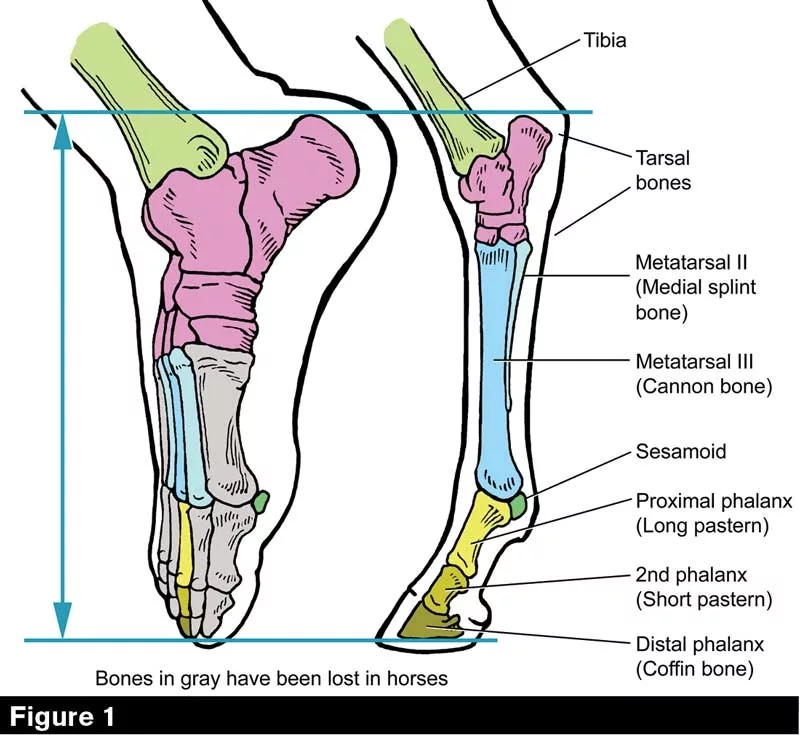
    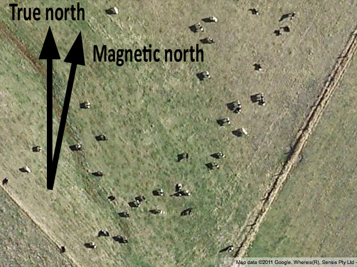
  

  <figcaption>Even though horses and cows are kind of weird in their own special ways... (<a href="https://www.americanfarriers.com/articles/12941-hock-provides-the-horse-thrust-under-immense-strain" target="_blank" rel="noopener">hock anatomy</a> · <a href="https://lostinscience.wordpress.com/2011/12/27/magnetic-cows-test-their-mettle/" target="_blank" rel="noopener">magnetic cows</a>)</figcaption>
</figure>

Because people so take local fauna for granted, they have to be alerted to its possible presence with bright, flashy warning signs. I like these a lot because they highlight how the familiar can once again become strange, especially when it is moseying across a highway or skittering underfoot on a paved trail. The land belongs to these creatures, and we've gone and imposed our human order all on top of it.

  <figure>
    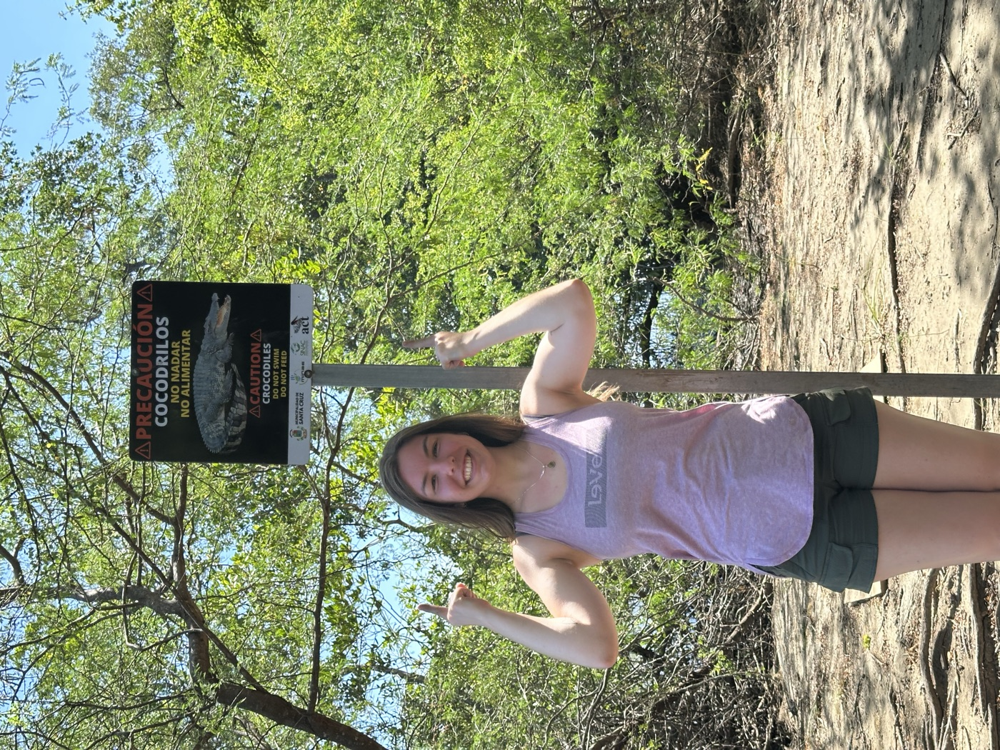
    <figcaption>Caution: crocodiles — Costa Rica.</figcaption>
  </figure>
  <figure>
    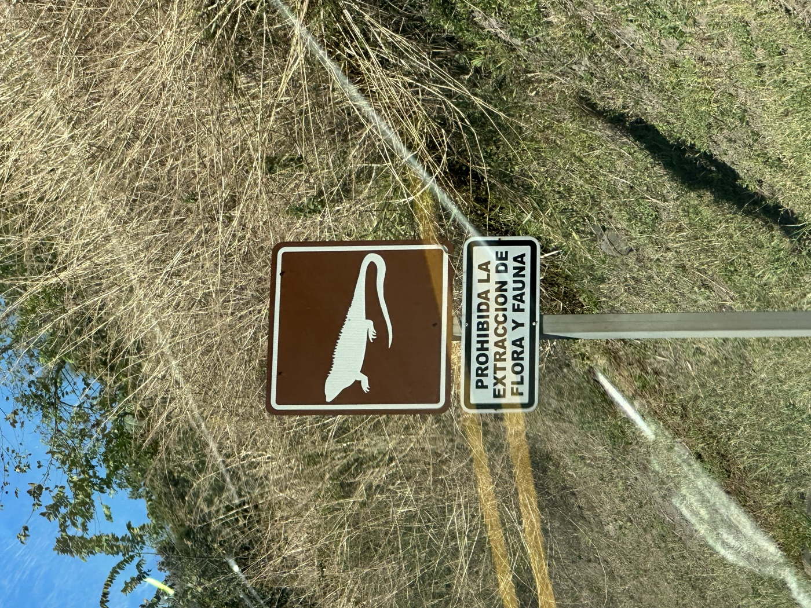
    <figcaption>Don't take the Iguanas — Costa Rica.</figcaption>
  </figure>
  <figure>
    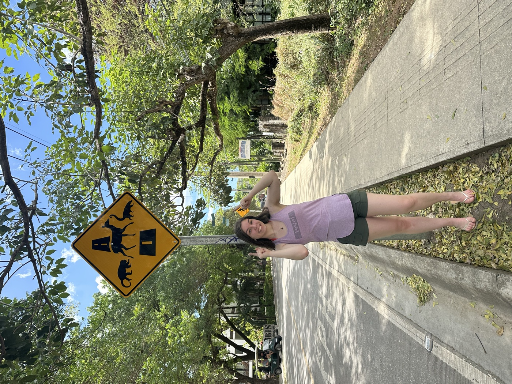
    <figcaption>Monkeys, deer, and coatis — Costa Rica.</figcaption>
  </figure>
  <figure>
    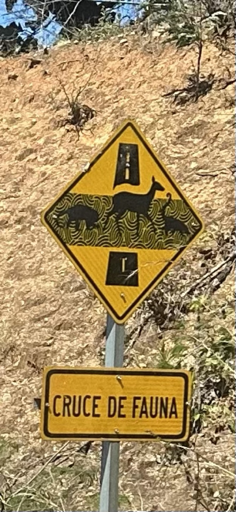
    <figcaption>Cruce de fauna — Costa Rica.</figcaption>
  </figure>
  <figure>
    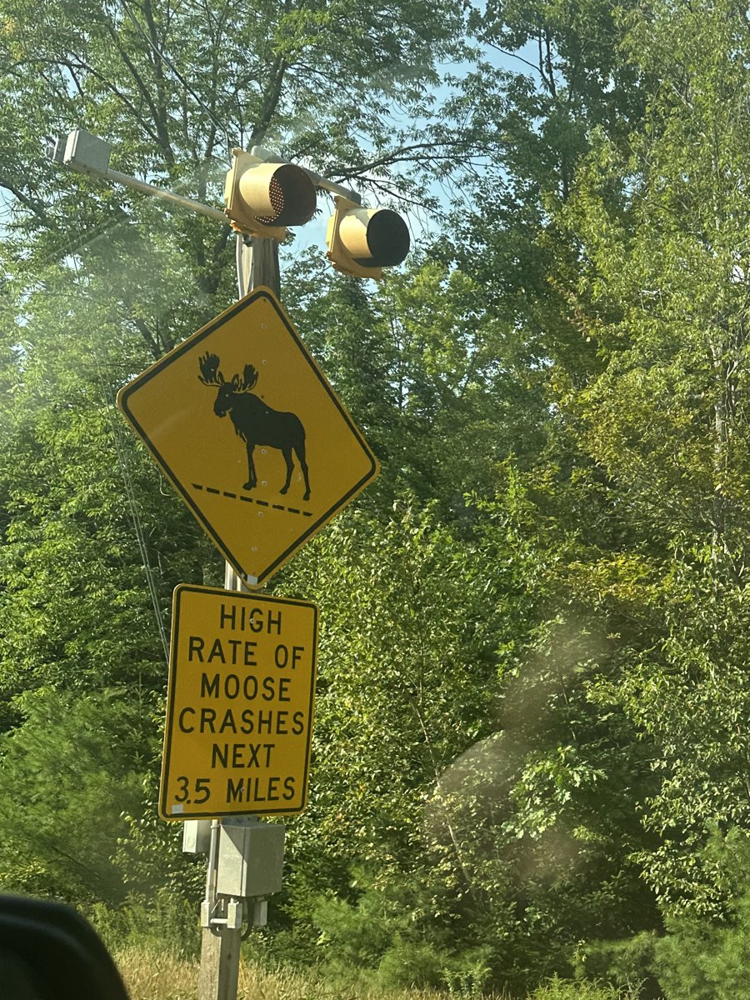
    <figcaption>High rate of moose crashes, next 3.5 miles — Maine.</figcaption>
  </figure>
  <figure>
    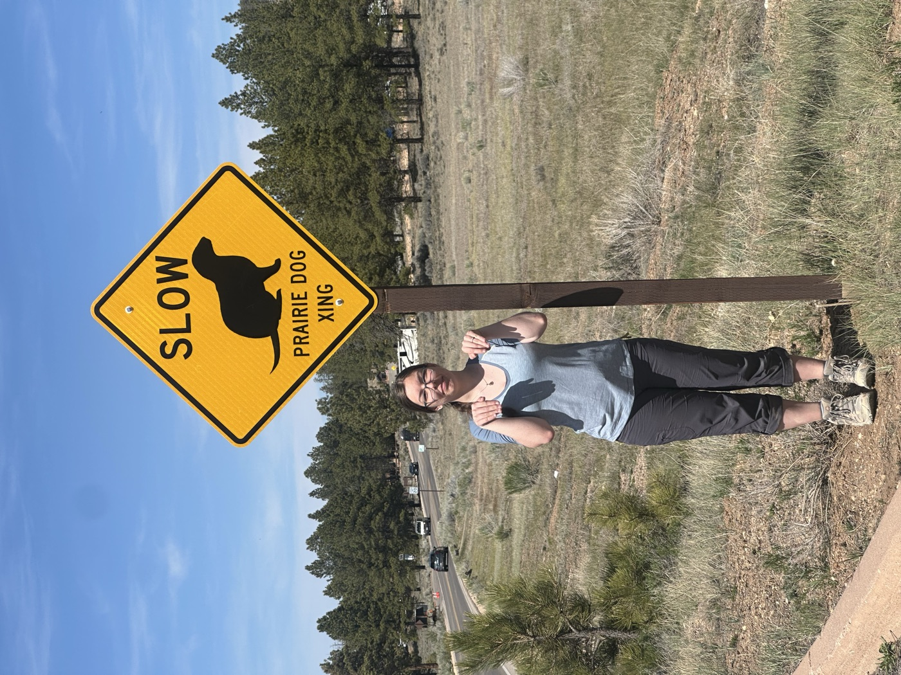
    <figcaption>Slow: prairie dog crossing — Bryce Canyon.</figcaption>
  </figure>

Whenever I travel, in lieu of other souvenirs, I like to take pictures of (or with, if it's safe) these wildlife crossing signs. To me, they are the most delightful blend of semiotics, conservation, and civil engineering that modernity has to offer. Just think of the entire string of events that led to this sign: Recognized need → Design → Manufacture → Installation → Appreciation. All for "Danger: Camel!" to stand along a highway in the Karakum Desert.

  <figure>
    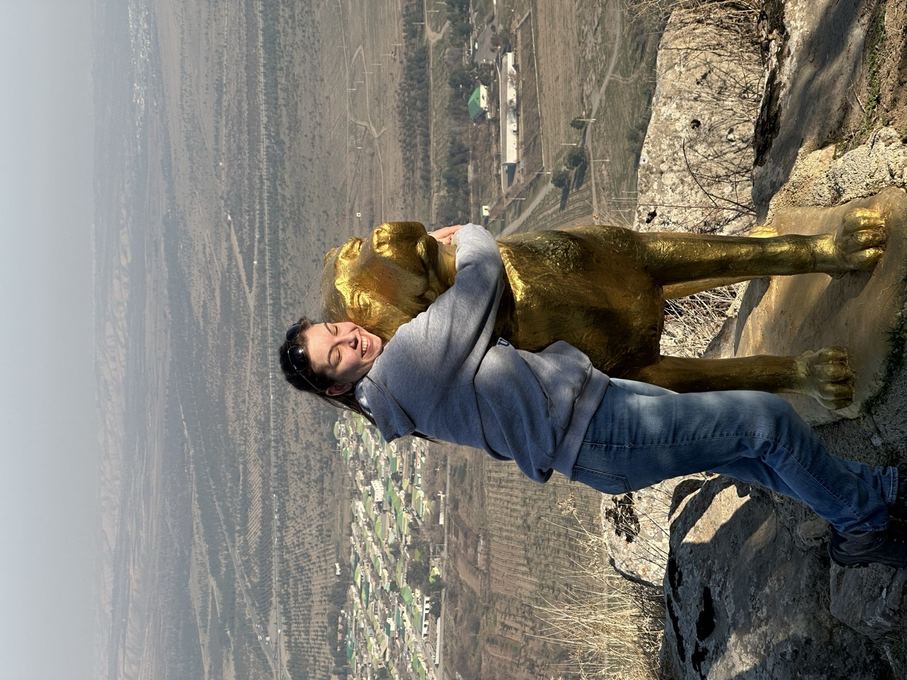
    <figcaption>Hugging an Alabai on the Health Walk in Ashgabat.</figcaption>
  </figure>
  <figure>
    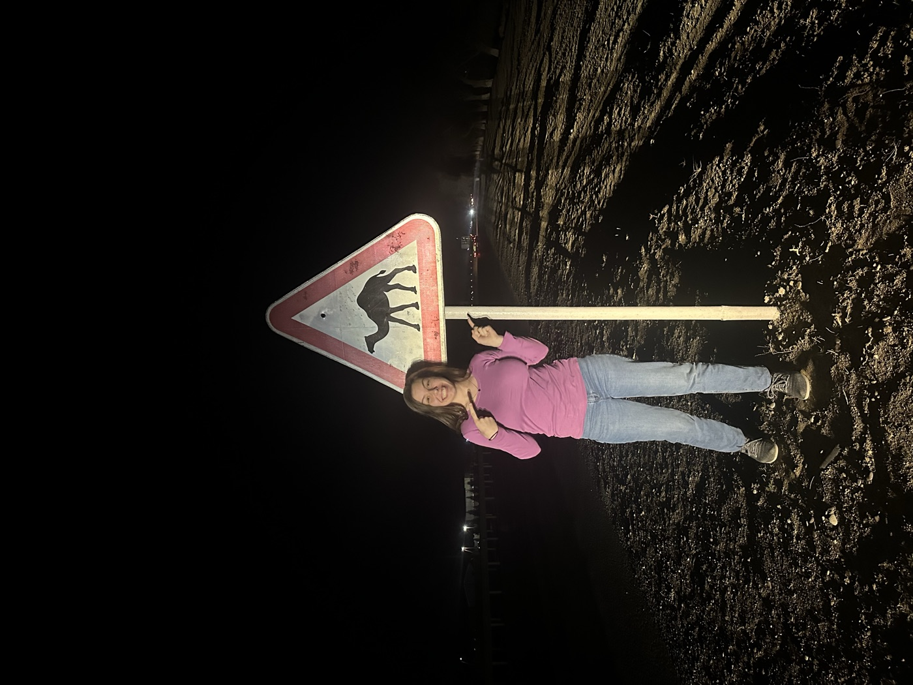
    <figcaption>"Danger: Camel," on the highway to Mary.</figcaption>
  </figure>

<figure class="fig-small">
  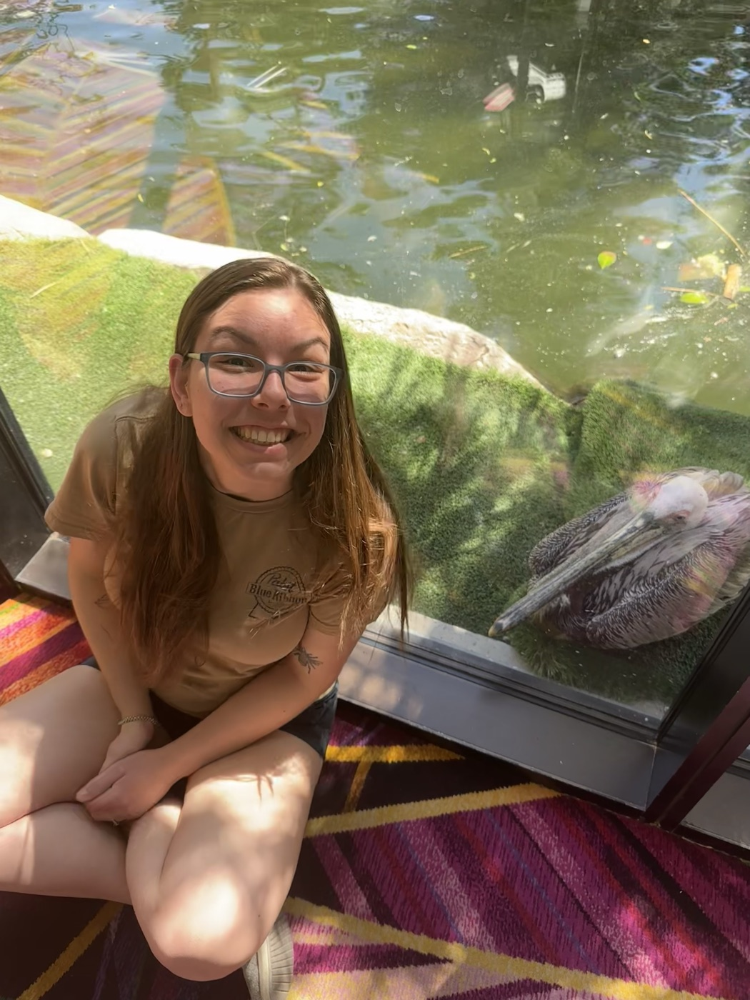
  <figcaption>A pelican at the Flamingo, on the Las Vegas Strip.</figcaption>
</figure>

So hurrah for weird critters and hurrah for the signs that remind us that they share the Earth with us. Meanwhile, I'll be out on the hunt for more signs!
