Every computer science student encounters *foobar* sooner or later in their education. Usually without any preamble or explanation of convention, *foobar* or *foo* is written on blackboards, used in examples, and appears in textbooks. Probably as something like this, from K-State's [*Introduction to Python*](https://textbooks.cs.ksu.edu/intro-python/06-functions/index.print.html):

<pre class="foo-vscode"><code>1def foo():&#10;2    print("eye")&#10;3&#10;4&#10;5def bar():&#10;6    print("to")&#10;7&#10;8&#10;9foo()&#10;10bar()&#10;11foo()</code></pre>

And the thing is, like [so many other things in higher education](https://en.wikipedia.org/wiki/Hidden_curriculum), nobody ever explains what foobar means. Rarer still, nobody thinks to ask. Students just seem to acquire it implicitly, or just accept it as a fact of the foo-niverse.

I heard *foobar* for the first time when I was auditing CSCI S-7 at Harvard Summer School taught by Henry Leitner. In a class where he was introducing the concept of an algorithm, he handed a student in the front row a dictionary and asked him to search for *foobar*. Of course, he didn't find it, and it prompted a lesson on approaches to search. I wrote down *foobar??* in the corner of my notes, and didn't think about it much until I sat down to write this blog post.

But I've had an epiphany and I need to share with you what's been revealed to me. I want to make something absolutely, explicitly clear, without any hint of ambig-foo-ity. **I love foobar**. It's a goofy, sweet word. It could be a fat golden retriever's name (with potential nicknames Fooby or Boofy). It could be a muppet. It could be a beloved family nickname, perhaps given by a toddler-age sibling who couldn't pronounce something like Robert or Theodore quite correctly. *"Oh, my folks call me Foobar. It's a long story."*

<figure class="foo-meme">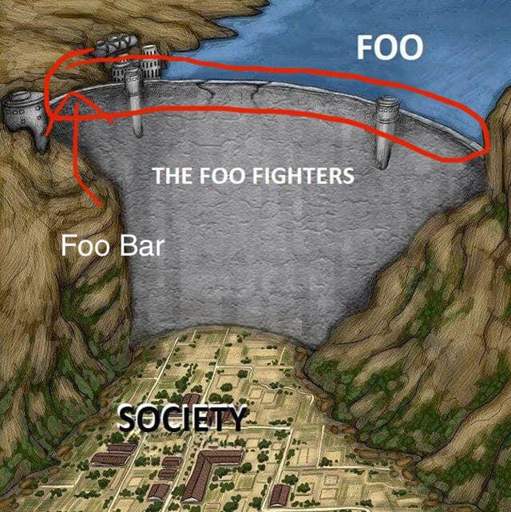<figcaption>This meme is implying that the Foo Fighters are protecting society from Foo (with fighting), but I like to think that it’s saying that the concept of the Foo Fighters is the only psychic protection humanity has against the collective volume of Foo-things in Foo-space.<a class="foo-source" href="https://knowyourmeme.com/memes/foo-fighters-vs-the-foo" target="_blank" rel="noopener">Know Your Meme</a></figcaption></figure>

What I have gathered for you here today is the ultimate celebration of foobar and its meronym, foo. I have chosen to foo-cus on (rough) homophones rather than a strict adherence to spelling or direct relation to CS. Consequently, I have excluded *foo* [ˈɸɔː] ("in, inside") in Murui Huitoto, *phở* [fəː˧˩] in Vietnamese, and English words like *fool*, *foosball*, or *futon*. Because Fu/Foo is a very common last name, I have only included a few famous Fu/Foo/Fous, especially those whose work I admire.

So here's some foo-d for thought, and foo-sic for the soul. For the optimal experience, listen to [*Canon in Foo*](#foo-foo-song) while you browse.

  

<section class="foo-piece kind-mixed font-book tone-ochre" id="foo-tmrc-foo" data-item="tmrc-foo"><h3 class="foo-name">The sacred syllable</h3>

<figure data-pick="c2">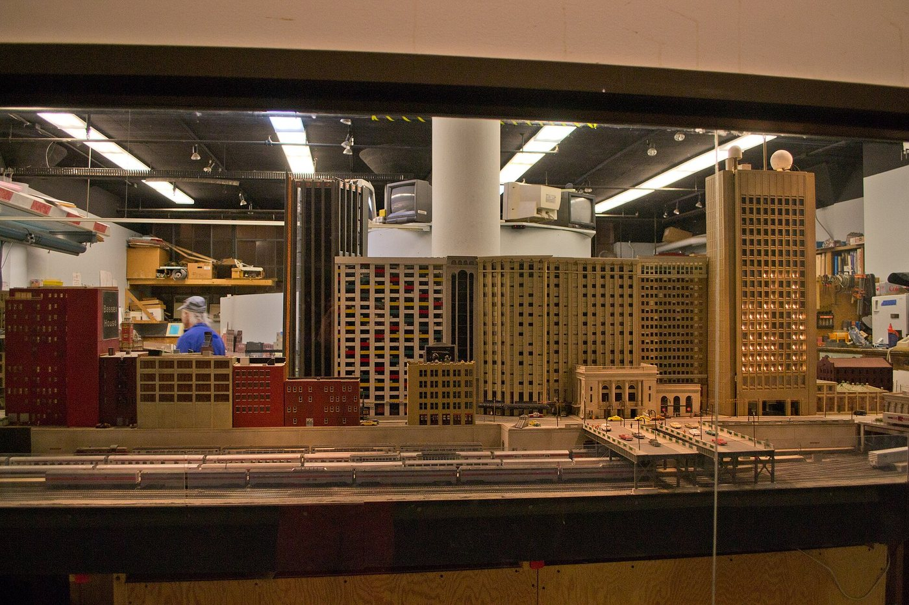<figcaption><a class="foo-source" href="https://commons.wikimedia.org/wiki/File:Tech_Model_Railroad_Green_Building.jpg" target="_blank" rel="noopener">Wikimedia</a></figcaption></figure>

FOOTech Model Railroad Club, MIT

FOO: the sacred syllable (FOO MANI PADME HUM); to be spoken only when under inspiration to commune with the Deity. Our first obligation is to keep the Foo Counters turning.
<a class="foo-source" href="https://www.gricer.com/tmrc/dictionary1959.html" target="_blank" rel="noopener">Peter Samson · TMRC, 1959</a>

</section>
<section class="foo-piece kind-image font-mono tone-plum" id="foo-fu162" data-item="fu162">

<figure data-pick="c4">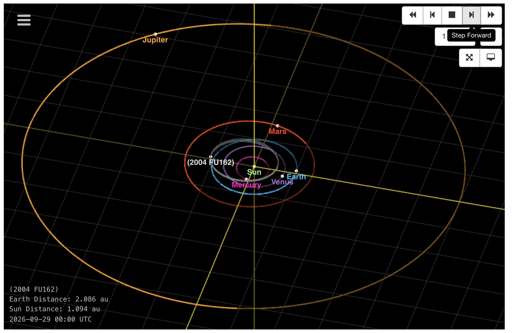<figcaption>
2004 FU162An asteroid observed for 44 minutes on 31 March 2004
<a class="foo-source" href="https://ssd.jpl.nasa.gov/tools/sbdb_lookup.html#/?sstr=2004%20FU162" target="_blank" rel="noopener">Screenshot</a></figcaption></figure>

</section>
  

  

<section class="foo-piece kind-mixed font-book tone-umber" id="foo-foo-song" data-item="foo-song"><h3 class="foo-name">Canon in Foo</h3>

<figure class="foo-song">

foo · barCanon in Foo1

❦ FOO·BAR ❦FB 000CLAUDE OPUS 5.5: CANON IN FOOSUNO AISTEREO

<button type="button" class="foo-record-play" aria-label="Play Canon in Foo"><svg class="i-play" viewBox="0 0 16 16" aria-hidden="true"><path d="M4 2.5v11l9-5.5z"/></svg><svg class="i-pause" viewBox="0 0 16 16" aria-hidden="true"><path d="M3.5 2.5h3v11h-3zM9.5 2.5h3v11h-3z"/></svg></button><input type="range" class="foo-record-seek" min="0" max="1000" value="0" step="1" aria-label="Seek">0:00

<audio controls preload="metadata" src="../assets/audio/blog/foobar/foobar-foobar.m4a">Your browser can’t play this audio.</audio></figure>

Canon in FooSuno AI · lyrics by Claude Opus 5.5
<a class="foo-source" href="https://suno.com/s/MuMLrIMePZwnsDZb" target="_blank" rel="noopener">Suno</a>

</section>
<section class="foo-piece kind-mixed font-sans tone-slate" id="foo-fubar-website" data-item="fubar-website"><h3 class="foo-name">fubar.com</h3>

<figure><figcaption><a class="foo-source" href="https://web.archive.org/web/20080229103514/http://www.fubar.com:80/" target="_blank" rel="noopener">Wayback Machine · 2008</a></figcaption></figure>

fubar.com“the first online bar,” 2005

Fubar, billed as the “first online bar and happy hour” is the fastest growing social network, having increased its traffic by 3,272,217% over the 12 months to the end of February 2008.
<a class="foo-source" href="https://techcrunch.com/2008/03/07/fubar-grows-over-3-million-percent-in-a-year" target="_blank" rel="noopener">TechCrunch · 2008</a>

</section>
  

All of the other nonsense placeholder conventions (“<a href="https://en.wikipedia.org/wiki/Metasyntactic_variable">metasyntactic variables</a>”) don’t seem to have the same <em>je ne sais foo</em>, if you know what I mean. Here’s a short list of examples: baz, qux, xyzzy, corge, grault, garply, waldo, fred, plugh, thud, dummy. To my ear, these all sound kind of dull or ungraceful, while <em>foobar</em> seems to roll off the tongue.

  

<section class="foo-piece kind-mixed font-sans tone-sage" id="foo-dot-foo" data-item="dot-foo"><h3 class="foo-name">.foo</h3>

<figure data-pick="c4"><figcaption><a class="foo-source" href="https://www.registry.google/tlds/foo/" target="_blank" rel="noopener">Google Registry</a></figcaption></figure>

.fooa top-level domain for developers

Secure domains for developers and technology lovers … When you’re programming, change is constant. You can use .foo for everything and anything.
<a class="foo-source" href="https://www.registry.google/tlds/tech/" target="_blank" rel="noopener">Google Registry</a>

</section>
<section class="foo-piece kind-image font-display tone-plum" id="foo-fr-fou-de-bassan" data-item="fr-fou-de-bassan">

<figure data-pick="c1"><figcaption>
fou de BassanFrench · the northern gannet
<a class="foo-source" href="https://commons.wikimedia.org/wiki/File:Morus_bassanus_adu.jpg" target="_blank" rel="noopener">Wikimedia</a></figcaption></figure>

</section>
  

  

<section class="foo-piece kind-image font-mono tone-terracotta foo-stack" id="foo-fused-sufu" data-item="fused-sufu"><h3 class="foo-name">Fu &amp; SuFu</h3>

<figure>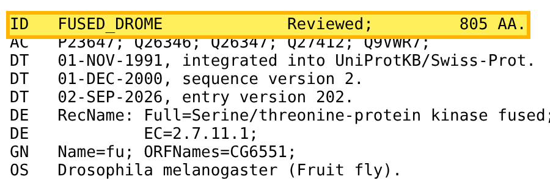<figcaption><a class="foo-source" href="https://www.uniprot.org/uniprotkb/P23647/entry" target="_blank" rel="noopener">UniProt</a></figcaption></figure><figure>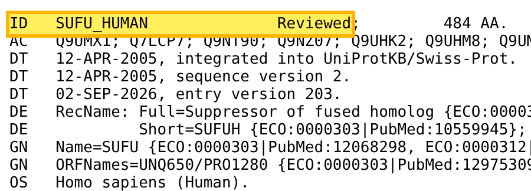<figcaption>
Fused (FU) &amp; Suppressor of fused (SUFU)Hedgehog signaling pathway genes
<a class="foo-source" href="https://www.uniprot.org/uniprotkb/Q9UMX1/entry" target="_blank" rel="noopener">UniProt</a></figcaption></figure>

</section>
<section class="foo-piece kind-mixed font-mono tone-ochre" id="foo-vax-fubar" data-item="vax-fubar"><h3 class="foo-name">FUBAR</h3>

<figure data-pick="c2">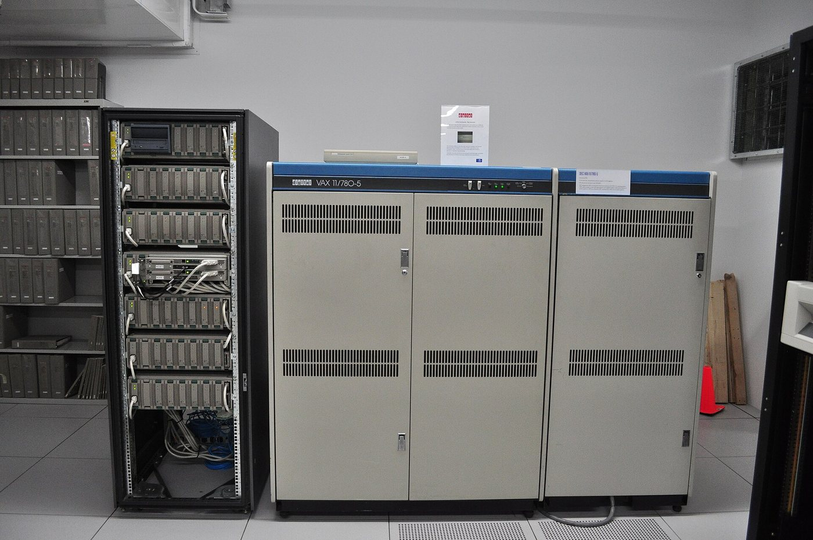<figcaption><a class="foo-source" href="https://commons.wikimedia.org/wiki/File:LCM_-_DEC_VAX_11-780-5_-_01.jpg" target="_blank" rel="noopener">Wikimedia</a></figcaption></figure>

FUBARin the 4BSD Unix source, 1980

/* Failed UNIBUS Address Register, FUBAR */
#define FUA 0xffff
/* Failed UNIBUS Address Field */
<a class="foo-source" href="https://www.tuhs.org/cgi-bin/utree.pl?file=4BSD/usr/src/sys/h/uba.h" target="_blank" rel="noopener">TUHS · 4BSD, 1980</a>

</section>
  

<em>Foobar</em> has a tantalizing mystery about it. Nobody knows exactly where it began. The earliest foo appeared in the <a href="https://en.wikipedia.org/wiki/Smokey_Stover">Smokey Stover</a> comics in the 1930s. Then WWII gave us <a href="https://en.wikipedia.org/wiki/List_of_military_slang_terms#FUBAR">FUBAR</a>, which I won’t spell out for you here. And from 1959 on, it entered computing and hacker culture, the apotheotic example coming from the <a href="https://www.gricer.com/tmrc/dictionary1959.html">Tech Model Railroad Club’s dictionary</a> at MIT, which calls FOO “the sacred syllable” and declares, “Our first obligation is to keep the Foo Counters turning.” For a more detailed etymology of <em>foobar</em>, see <a href="https://www.rfc-editor.org/rfc/rfc3092">RFC 3092</a>, published on April 1st, 2001 (foo-thousand-one).

The real reason we can’t seem to identify the true ur-foo is that foo is ubiquitous across languages. The consonant /f/ occurs in about 44% of languages, and /u/ in about 88% (<a href="https://phoible.org/">PHOIBLE</a>). If a language happens to have both, it’s a relatively unremarkable syllable. English, Scots, French, Mandarin, and Spanish all have some variation of /fu/. In Mandarin, with respect to tone, fu can mean husband/man (夫 fū), woman/wife (妇 fù), skin (肤 fū), good fortune (福 fú), clothing (服 fú), mansion/government office (府 fǔ), rotten (腐 fǔ), rich (富 fù), to float (浮 fú), to serve (服 fú), to carry/to lose (负 fù), to return (复 fù).

  

<section class="foo-piece kind-mixed font-type tone-sage" id="foo-foo-officer" data-item="foo-officer"><h3 class="foo-name">FOO was here</h3>

<figure><figcaption><a class="foo-source" href="https://commons.wikimedia.org/wiki/File:British_and_French_artillery_observers_Battle_of_Langemarck_1917_IWM_Q_2723.jpg" target="_blank" rel="noopener">Wikimedia</a></figcaption></figure>

FOO was hereForward Observation Officer

Period sources reported that ‘FOO’ became a semi-legendary subject of WWII British-army graffiti more or less equivalent to the American Kilroy. Where British troops went, the graffito “FOO was here” or something similar showed up. Several slang dictionaries aver that FOO probably came from Forward Observation Officer.
<a class="foo-source" href="http://www.catb.org/jargon/html/F/foo.html" target="_blank" rel="noopener">The Jargon File</a>

</section>
<section class="foo-piece kind-image font-display tone-umber" id="foo-fu-gluten" data-item="fu-gluten">

<figure><figcaption>
Fu (麩)Japanese wheat gluten
<a class="foo-source" href="https://commons.wikimedia.org/wiki/File:Japanese_Wheat_gluten_Fu.JPG" target="_blank" rel="noopener">Wikimedia</a></figcaption></figure>

</section>
  

  

<section class="foo-piece kind-image font-display tone-terracotta" id="foo-foongus" data-item="foongus">

<figure data-pick="c0"><figcaption>
FoongusPokémon #0590
<a class="foo-source" href="https://bulbapedia.bulbagarden.net/wiki/Foongus_(Pok%C3%A9mon)" target="_blank" rel="noopener">Bulbapedia</a></figcaption></figure>

</section>
<section class="foo-piece kind-mixed font-display tone-slate" id="foo-foobar-rabbit" data-item="foobar-rabbit"><h3 class="foo-name">FooBar</h3>

<figure>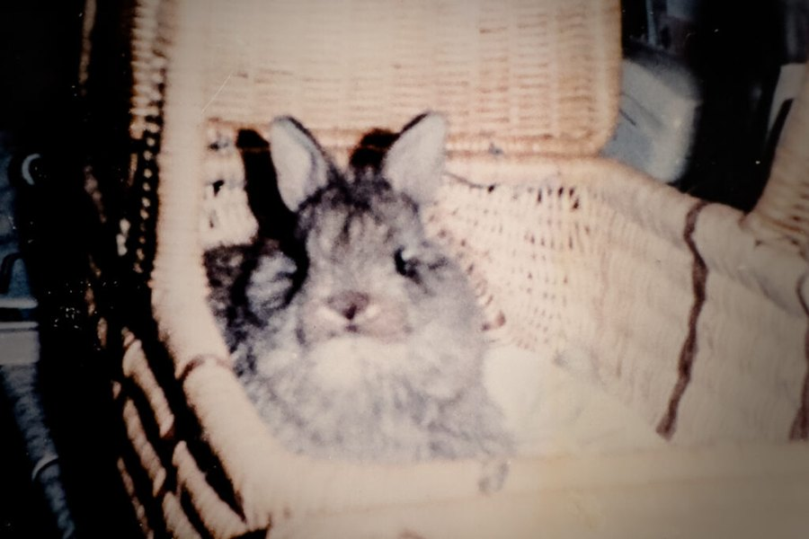<figcaption><a class="foo-source" href="https://rabbit.org/stories/foo-bar/" target="_blank" rel="noopener">rabbit.org</a></figcaption></figure>

FooBara house rabbit, 1990

FooBar was our first house rabbit. He was born on June 24, 1990, and he came into our lives in August of 1990. He spent seven and a half wonderful years here with us and his friends Zowie, Zippy, and Izzy.
<a class="foo-source" href="https://rabbit.org/stories/foo-bar/" target="_blank" rel="noopener">Paige K Parsons · House Rabbit Society</a>

</section>
  

It was just the time that someone combined it with *bar* in English that we were really cooking with fire. I'll show you: let's talk about the foo-netics of foobar. I'm going to focus specifically on General American English, because that's the dialect I'm most familiar with.

*Foobar* is pronounced [ˈfuˌbɑɹ], with primary stress on the first syllable and a secondary stress on the second. This is common in compound words like *blackbird*, *classmate*, or *hotdog*. Neither of the vowels reduce (to something like [ˈfubɚ], weird), and therefore it really does behave like the fuse of *foo* and *bar*. Both starting consonants /f/ and /b/ are labial, and the vowel sounds transition nicely from high back rounded [u] to low back unrounded [ɑ], almost like it was always meant to be said. *Foobar*...

  

<section class="foo-piece kind-image font-display tone-terracotta" id="foo-fu-manchu" data-item="fu-manchu">

<figure><figcaption>
Fu ManchuBoris Karloff · The Mask of Fu Manchu, 1932
<a class="foo-source" href="https://commons.wikimedia.org/wiki/File:Boris_Karloff_in_The_Mask_of_Fu_Manchu.jpg" target="_blank" rel="noopener">Wikimedia</a></figcaption></figure>

</section>
<section class="foo-piece kind-mixed font-type tone-ochre foo-logo" id="foo-foobar-plate" data-item="foobar-plate"><h3 class="foo-name">FOOBAR</h3>

<figure><figcaption><a class="foo-source" href="https://granitegeek.concordmonitor.com/2019/07/18/outrage-foobar-cant-be-used-on-a-vanity-plate/" target="_blank" rel="noopener">Granite Geek</a></figcaption></figure>

FOOBARa rejected vanity plate, New Hampshire

I found out this year the state won’t allow FOOBAR on a vanity plate! They confuse it with FUBAR.
<a class="foo-source" href="https://granitegeek.concordmonitor.com/2019/07/18/outrage-foobar-cant-be-used-on-a-vanity-plate/" target="_blank" rel="noopener">David Brooks · Granite Geek, 2019</a>

</section>
  

  

<section class="foo-piece kind-image font-display tone-plum" id="foo-silence-is-foo" data-item="silence-is-foo">

<figure data-pick="c0">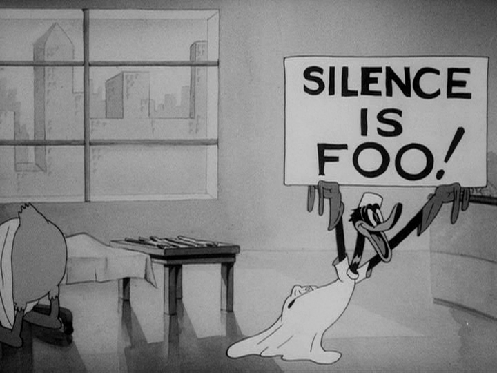<figcaption>
SILENCE IS FOO!The Daffy Doc, 1938
<a class="foo-source" href="https://tralfaz.blogspot.com/2020/08/daffy-says.html" target="_blank" rel="noopener">Tralfaz</a></figcaption></figure>

</section>
<section class="foo-piece kind-mixed font-sans tone-slate" id="foo-foobar-pro" data-item="foobar-pro"><h3 class="foo-name">Foobar Pro</h3>

<figure><figcaption><a class="foo-source" href="https://www.cheapprofonts.com/Foobar_Pro.php" target="_blank" rel="noopener">Cheap ProFonts</a></figcaption></figure>

Foobar Proa typeface by Roger S. Nelsson

This is the cool and stylish relative to Familiar Pro. Like a cousin. Or perhaps a second cousin twice removed. Because parts of the letters are removed, see...
<a class="foo-source" href="https://www.cheapprofonts.com/Foobar_Pro.php" target="_blank" rel="noopener">Cheap ProFonts</a>

</section>
  

Additionally, the graphetics of foobar are incredibly pleasant. It looks like it could be a naturally occurring word. Unlike my previous examples of *xyzzy* or *qux*, it has a shape shared by many common English words. It goes: consonant, vowel cluster, consonant, vowel, consonant. There's no weird clusters, no end-of-the-alphabet oddballs like x, y, or z. Could *phoobar* have been as famous? Could *fuhbahr*?

I think these linguistic properties contribute greatly to the memetic signi-foo-cance of foobar, especially in nerd world. It's become a kind of cultural touchstone, almost an easter egg. And it's kind of beautiful as well, because as a junk variable, foobar refers to nothing, but to us, foobar means everything.

Every time you define a variable as *foo*, know that you are participating in a decades-old practice with a rich linguistic and cultural history. If you are new to Computer Science, I hope that this knowledge guides you on your journey. If you are an old-timer, take a moment to tell your juniors a bit about the history of foobar. It's not a word in the [Merriam-Webster dictionary](https://www.harvard.com/book/9780877796688) (the exact book Henry Leitner tore in half to explain binary search), but it's written 4 million times on GitHub, in the archives of Usenet, and across all of our hearts.

<em>blog post over, only foos below</em>

  

<section class="foo-piece kind-mixed font-mono tone-plum" id="foo-foo-dft" data-item="foo-dft">

<figure data-pick="c3">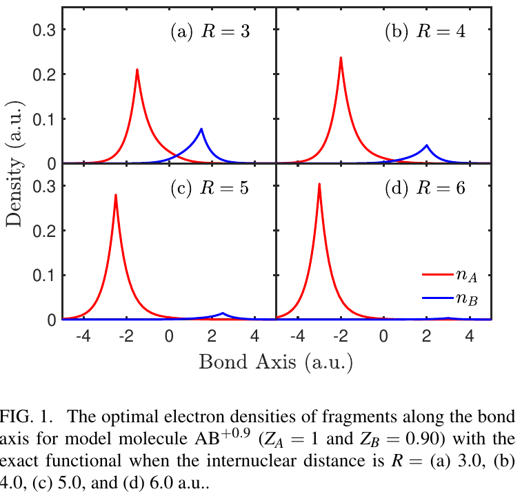<figcaption>
FOOFractionally occupied orbitals in partition DFT
<a class="foo-source" href="https://arxiv.org/abs/2203.05594" target="_blank" rel="noopener">Zhang &amp; Wasserman · J. Chem. Phys., 2022</a></figcaption></figure>

Similarly, the FOO fragment dipole moments provide an upper bound to the ENS dipoles.
<a class="foo-source" href="https://pubs.aip.org/aip/jcp/article/156/22/224113/2841375/Split-electrons-in-partition-density-functional" target="_blank" rel="noopener">Zhang &amp; Wasserman · J. Chem. Phys., 2022</a>

</section>
<section class="foo-piece kind-text font-mono tone-sage" id="foo-rfc1545-foobar" data-item="rfc1545-foobar"><h3 class="foo-name">FOOBAR</h3>

FOOBAR

FTP Operation Over Big Address Records (FOOBAR)  This paper describes a convention for specifying longer addresses in the PORT command.
<a class="foo-source" href="https://www.rfc-editor.org/rfc/rfc1545" target="_blank" rel="noopener">RFC 1545 · 1993</a>

</section>
<section class="foo-piece kind-mixed font-book tone-umber" id="foo-foo-foo-band" data-item="foo-foo-band"><h3 class="foo-name">The Foo-Foo band</h3>

<figure data-pick="c3"><figcaption><a class="foo-source" href="https://commons.wikimedia.org/wiki/File:Loch_Torridon_under_sail.jpg" target="_blank" rel="noopener">Wikimedia</a></figcaption></figure>

The Foo-Foo banda ship’s band on a clipper

We sighted the Jennie Harkness, obviously American, at daylight right ahead in the S.E. trades; at noon we were alongside her, and our Foo-Foo band played &quot;Yankee-Doodle&quot; as we passed her.
<a class="foo-source" href="https://archive.org/download/colonialclippers00lubbrich/page/leaf214_w1200.jpg" target="_blank" rel="noopener">Basil Lubbock · The Colonial Clippers, 1921</a>

</section>
<section class="foo-piece kind-mixed font-book tone-slate" id="foo-foo-foo-festival" data-item="foo-foo-festival"><h3 class="foo-name">Foo Foo Festival</h3>

<figure><figcaption><a class="foo-source" href="https://www.visitpensacola.com/events/signature-events/foofoofestival/" target="_blank" rel="noopener">Visit Pensacola</a></figcaption></figure>

Foo Foo FestivalPensacola, Florida

A 19th century term, a “foo foo,” is a spontaneous band of musicians, especially on a sailing vessel. Foo Foo Fest organizers wanted to emulate the spontaneity of such a performance, providing Pensacola with a flurry of high-quality art and culture events to liven up the shoulder season here in the Pensacola Bay Area. Plus, it’s a cute name!
<a class="foo-source" href="https://www.visitpensacola.com/events/signature-events/foofoofestival/" target="_blank" rel="noopener">Visit Pensacola</a>

</section>
<section class="foo-piece kind-mixed font-book tone-plum" id="foo-enm-foo" data-item="enm-foo">

<figure data-pick="c1"><figcaption><a class="foo-source" href="https://commons.wikimedia.org/wiki/File:Taymouth_Hours_Virgin_and_Devil.jpg" target="_blank" rel="noopener">Wikimedia</a></figcaption></figure>

fo (also foo, ffoo, foe, fa)

fo · /fɔː/

Middle English · noun (pl. fon, fos)

a foe, enemy or opponent: an enemy of the true religion; an enemy combatant; (Christianity) Satan, the enemy of mankind; a harmful or ruinous force

From the oblique stem of Old English ġefāh; ultimately Proto-West Germanic *faih 'hostile'; descendant: English foe
<a class="foo-source" href="https://en.wiktionary.org/wiki/fo" target="_blank" rel="noopener">Wiktionary</a>

</section>
<section class="foo-piece kind-mixed font-book tone-umber" id="foo-du-fu" data-item="du-fu">

<figure data-pick="c1"><figcaption>
Du Fu 杜甫Tang dynasty poet
<a class="foo-source" href="https://commons.wikimedia.org/wiki/File:Dufu.jpg" target="_blank" rel="noopener">Wikimedia</a></figcaption></figure><figure>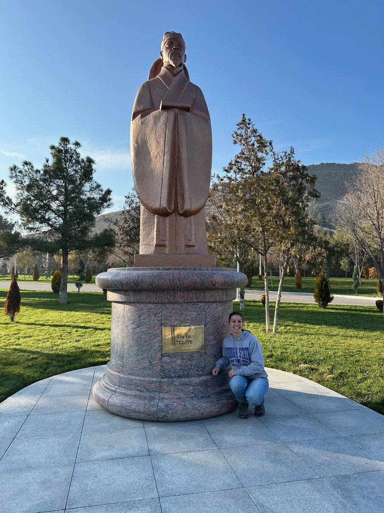<figcaption>Du Fu statue in Ashgabat, Turkmenistan</figcaption></figure>

Du Fu (Chinese: 杜甫; pinyin: Dù Fǔ; Wade–Giles: Tu Fu; 712 – 770) was a Chinese poet and government official of the Tang dynasty. Together with his older contemporary and friend Li Bai, he is one of the principal poets associated with Tang poetry.
<a class="foo-source" href="https://en.wikipedia.org/wiki/Du_Fu" target="_blank" rel="noopener">Wikipedia</a>

</section>
<section class="foo-piece kind-mixed font-book tone-plum" id="foo-zh-fu-rhapsody" data-item="zh-fu-rhapsody">

<figure><figcaption><a class="foo-source" href="https://commons.wikimedia.org/wiki/File:Liangyuan_Gathering.jpg" target="_blank" rel="noopener">Wikimedia</a></figcaption></figure>

賦

fù · [fu˥˩]

Chinese · noun (literary form)

often translated “rhapsody” or “poetic exposition”: a form of Chinese rhymed prose that was the dominant literary form in China during the Han dynasty (206 BC – AD 220)
<a class="foo-source" href="https://en.wikipedia.org/wiki/Fu_(literature)" target="_blank" rel="noopener">Wikipedia</a>

</section>
<section class="foo-piece kind-mixed font-mono tone-ochre" id="foo-salesforce-foo" data-item="salesforce-foo"><h3 class="foo-name">FOO</h3>

<figure><figcaption><a class="foo-source" href="https://live.deutsche-boerse.com/equity/salesforce-com-inc" target="_blank" rel="noopener">Deutsche Börse · 25 Sep 2026</a></figcaption></figure>

FOOSalesforce’s ticker on Xetra and the Frankfurt Stock Exchange

salesforce.com Inc. ISIN: US79466L3024 | WKN: A0B87V | Symbol: FOO | Type: Equity
<a class="foo-source" href="https://live.deutsche-boerse.com/equity/salesforce-com-inc" target="_blank" rel="noopener">Deutsche Börse</a>

</section>
<section class="foo-piece kind-mixed font-book tone-slate" id="foo-es-fufurufo" data-item="es-fufurufo">

<figure data-pick="c2">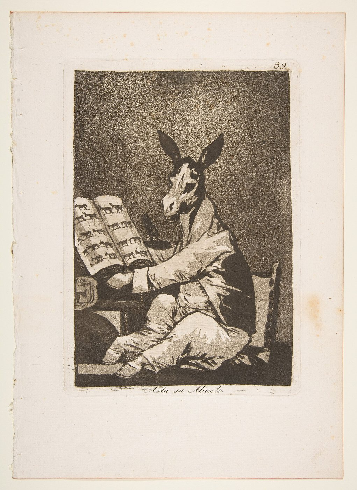<figcaption><a class="foo-source" href="https://commons.wikimedia.org/wiki/File:Plate_39_from_%27Los_Caprichos%27-_And_so_was_his_grandfather._(Asta_su_Abuelo.)_MET_DP816977.jpg" target="_blank" rel="noopener">Wikimedia</a></figcaption></figure>

fufurufo, -a

/ˌfufuˈɾufo/

Spanish (El Salvador, colloquial) · adj.

(colloquial, El Salvador) stuck-up, smug, conceited (syn. engreído, petulante)

Esa vieja fufurufa se cree más que los demás.That smug woman thinks she's better than everybody else.
<a class="foo-source" href="https://en.wiktionary.org/wiki/fufurufo" target="_blank" rel="noopener">Wiktionary</a>

</section>
<section class="foo-piece kind-image font-display tone-ochre" id="foo-fufu" data-item="fufu">

<figure data-pick="c1"><figcaption>
FufuWest African pounded starch staple
<a class="foo-source" href="https://commons.wikimedia.org/wiki/File:Fufu_and_light_soup_in_asanka.jpg" target="_blank" rel="noopener">Wikimedia</a></figcaption></figure>

</section>
<section class="foo-piece kind-text font-display tone-umber" id="foo-es-ni-fu-ni-fa" data-item="es-ni-fu-ni-fa">

ni fu ni fa

/niˌfu niˈfa/

Spanish · phrase (invariable adj.)

(colloquial, idiom) so-so, nothing special, nothing to write home about
<a class="foo-source" href="https://en.wiktionary.org/wiki/ni_fu_ni_fa" target="_blank" rel="noopener">Wiktionary</a>

</section>
<section class="foo-piece kind-mixed font-mono tone-sage" id="foo-foobar-dea" data-item="foobar-dea"><h3 class="foo-name">Foobar versus the DEA</h3>

<figure>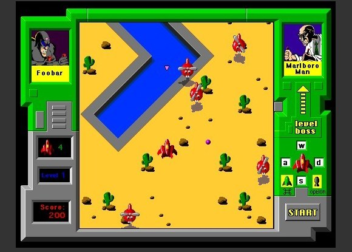<figcaption><a class="foo-source" href="https://www.macintoshrepository.org/3640-foobar-versus-the-dea" target="_blank" rel="noopener">Macintosh Repository</a></figcaption></figure>

Foobar versus the DEAa Macintosh game, 1997

A top down scrolling shooter similar to Mars Rising and Demos Rising. You have a normal shot and bombs used to destroy enemies on land/in water.
<a class="foo-source" href="https://www.macintoshrepository.org/3640-foobar-versus-the-dea" target="_blank" rel="noopener">Macintosh Repository</a>

</section>
<section class="foo-piece kind-text font-sans tone-plum" id="foo-foobar-companies" data-item="foobar-companies"><h3 class="foo-name">Foobar Ltd.</h3>

Foobar Ltd.companies named Foobar

11UK companies registered with Foobar in the name since 2010. 4 are still active.
<a class="foo-source" href="https://find-and-update.company-information.service.gov.uk/advanced-search/get-results?companyNameIncludes=foobar" target="_blank" rel="noopener">Companies House</a>
Foobar LTD · Foobar Consulting · Foobar Engineering · Foobar Recruitment · Foobar IT · Foobar Training · Foobar Technology · Foobar Operations

Foobar, Reykjavík: “the long-term investment company of Icelandic entrepreneur and climate investor David Helgason.”
<a class="foo-source" href="https://www.foobar.vc/" target="_blank" rel="noopener">foobar.vc</a>
foobar, Munich: “Enterprise Commerce &amp; AI Partner in the DACH Region.”
<a class="foo-source" href="https://foobar.agency/en" target="_blank" rel="noopener">foobar.agency</a>

</section>
<section class="foo-piece kind-mixed font-type tone-slate" id="foo-fubar" data-item="fubar"><h3 class="foo-name">Brother Fubar</h3>

<figure>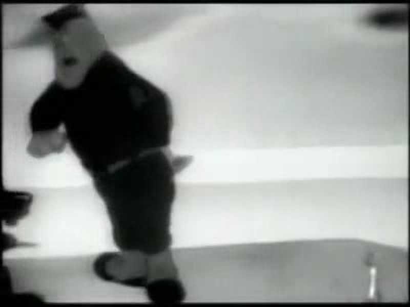<figcaption><a class="foo-source" href="https://commons.wikimedia.org/wiki/File:Private_Snafu-Three_Brothers.ogv" target="_blank" rel="noopener">Three Brothers (1944), Warner Bros. for the US Army · public domain, via Wikimedia Commons</a></figcaption></figure>

Brother FubarPrivate Snafu, 1944

FUBAR: F***ed Up Beyond All Recognition/Repair. From US Military in World War II. Sometimes sanitized to "Fouled Up ...".
<a class="foo-source" href="https://www.rfc-editor.org/rfc/rfc3092" target="_blank" rel="noopener">RFC 3092 · 2001</a>

</section>
<section class="foo-piece kind-mixed font-sans tone-umber" id="foo-ngram-tile" data-item="ngram"><h3 class="foo-name">foobar and FUBAR in books</h3>

<figure class="foo-ngram" data-y0="1930" data-geom="{&quot;W&quot;: 360, &quot;L&quot;: 26, &quot;R&quot;: 50, &quot;T&quot;: 10, &quot;B&quot;: 24, &quot;H&quot;: 250, &quot;ymax&quot;: 40, &quot;y1&quot;: 2022}" data-series="{&quot;FUBAR&quot;: [0.1, 0.14, 0.1, 0.08, 0.1, 0.13, 0.12, 0.13, 0.11, 0.16, 0.47, 1.07, 1.99, 2.81, 3.6, 3.91, 4.04, 3.88, 3.55, 2.79, 2.14, 1.67, 1.61, 1.65, 1.6, 1.56, 1.55, 1.53, 1.47, 1.45, 1.6, 1.92, 1.97, 1.95, 1.97, 1.89, 2.05, 2.23, 2.13, 2.06, 2.27, 2.63, 2.84, 2.86, 2.93, 3.18, 3.4, 3.26, 3.11, 3.05, 3.02, 2.85, 2.71, 2.6, 2.81, 2.62, 3.06, 3.35, 3.73, 4.39, 4.69, 5.03, 6.17, 6.62, 7.24, 7.46, 7.62, 8.63, 9.51, 10.79, 10.93, 12.22, 13.1, 14.89, 15.88, 17.14, 18.41, 20.72, 22.22, 25.61, 25.64, 28.81, 31.1, 32.31, 32.71, 33.09, 31.6, 32.01, 30.49, 29.64, 28.62, 28.62, 27.92], &quot;foobar&quot;: [0.13, 0.07, 0.06, 0.06, 0.06, 0.07, 0.05, 0.03, 0.07, 0.07, 0.07, 0.07, 0.05, 0.07, 0.08, 0.07, 0.08, 0.11, 0.12, 0.13, 0.14, 0.14, 0.13, 0.15, 0.17, 0.17, 0.16, 0.16, 0.17, 0.16, 0.13, 0.1, 0.12, 0.13, 0.11, 0.12, 0.11, 0.11, 0.12, 0.11, 0.1, 0.34, 0.32, 0.34, 0.4, 0.47, 0.52, 0.55, 0.47, 0.5, 0.67, 1.17, 1.45, 2.14, 3.3, 4.05, 5.82, 7.24, 7.74, 8.24, 8.73, 9.08, 10.87, 11.09, 12.48, 13.46, 15.59, 17.49, 18.68, 19.82, 20.84, 20.5, 21.73, 22.34, 22.67, 23.12, 22.09, 25.63, 25.55, 24.38, 22.43, 21.59, 23.18, 24.2, 20.6, 21.17, 21.18, 21.19, 19.18, 16.61, 14.89, 13.68, 11.57]}"><svg class="foo-ngram-svg" viewBox="0 0 360 250" role="img" aria-labelledby="foo-ngram-title foo-ngram-desc"><desc id="foo-ngram-desc">Line chart, 1930 to 2022, in occurrences per billion words. FUBAR rises from zero in the early 1940s, stays low through the 1970s, then climbs to about 33 in 2015. Foobar is near zero until the late 1970s, rises through the 1990s, peaks at about 26 in 2007, and falls to about 12 by 2022.</desc><line class="g" x1="26" x2="310" y1="226.0" y2="226.0"/><text class="ax" x="21" y="229.5" text-anchor="end">0</text><line class="g" x1="26" x2="310" y1="172.0" y2="172.0"/><text class="ax" x="21" y="175.5" text-anchor="end">10</text><line class="g" x1="26" x2="310" y1="118.0" y2="118.0"/><text class="ax" x="21" y="121.5" text-anchor="end">20</text><line class="g" x1="26" x2="310" y1="64.0" y2="64.0"/><text class="ax" x="21" y="67.5" text-anchor="end">30</text><line class="g" x1="26" x2="310" y1="10.0" y2="10.0"/><text class="ax" x="21" y="13.5" text-anchor="end">40</text><text class="ax" x="56.9" y="241" text-anchor="middle">1940</text><text class="ax" x="118.6" y="241" text-anchor="middle">1960</text><text class="ax" x="180.3" y="241" text-anchor="middle">1980</text><text class="ax" x="242.1" y="241" text-anchor="middle">2000</text><text class="ax" x="303.8" y="241" text-anchor="middle">2020</text><line class="base" x1="26" x2="310" y1="226.0" y2="226.0"/><line class="ann" x1="63.0" x2="63.0" y1="226.0" y2="107.2"/><text class="ann-t" x="66.0" y="116.2">1942</text><line class="ann" x1="174.2" x2="174.2" y1="226.0" y2="107.2"/><text class="ann-t" x="177.2" y="116.2">1978</text><path class="ln" d="M26.0 225.4 L29.1 225.2 L32.2 225.4 L35.3 225.5 L38.3 225.5 L41.4 225.3 L44.5 225.4 L47.6 225.3 L50.7 225.4 L53.8 225.1 L56.9 223.5 L60.0 220.2 L63.0 215.3 L66.1 210.8 L69.2 206.5 L72.3 204.9 L75.4 204.2 L78.5 205.0 L81.6 206.8 L84.7 210.9 L87.7 214.4 L90.8 217.0 L93.9 217.3 L97.0 217.1 L100.1 217.4 L103.2 217.6 L106.3 217.7 L109.3 217.7 L112.4 218.1 L115.5 218.2 L118.6 217.4 L121.7 215.6 L124.8 215.3 L127.9 215.5 L131.0 215.4 L134.0 215.8 L137.1 214.9 L140.2 214.0 L143.3 214.5 L146.4 214.9 L149.5 213.8 L152.6 211.8 L155.7 210.6 L158.7 210.5 L161.8 210.2 L164.9 208.8 L168.0 207.7 L171.1 208.4 L174.2 209.2 L177.3 209.5 L180.3 209.7 L183.4 210.6 L186.5 211.4 L189.6 212.0 L192.7 210.8 L195.8 211.8 L198.9 209.5 L202.0 207.9 L205.0 205.9 L208.1 202.3 L211.2 200.7 L214.3 198.9 L217.4 192.7 L220.5 190.2 L223.6 186.9 L226.7 185.7 L229.7 184.9 L232.8 179.4 L235.9 174.6 L239.0 167.8 L242.1 167.0 L245.2 160.0 L248.3 155.3 L251.3 145.6 L254.4 140.2 L257.5 133.4 L260.6 126.6 L263.7 114.1 L266.8 106.0 L269.9 87.7 L273.0 87.5 L276.0 70.4 L279.1 58.1 L282.2 51.5 L285.3 49.4 L288.4 47.3 L291.5 55.4 L294.6 53.1 L297.7 61.4 L300.7 65.9 L303.8 71.4 L306.9 71.5 L310.0 75.2" stroke="#B8612F"/><circle cx="310.0" cy="75.2" r="3" fill="#B8612F" stroke="#FAFAF7" stroke-width="1.5"/><text class="dl" x="316.0" y="79.2">FUBAR</text><path class="ln" d="M26.0 225.3 L29.1 225.6 L32.2 225.7 L35.3 225.7 L38.3 225.7 L41.4 225.6 L44.5 225.7 L47.6 225.8 L50.7 225.6 L53.8 225.6 L56.9 225.6 L60.0 225.6 L63.0 225.7 L66.1 225.6 L69.2 225.6 L72.3 225.6 L75.4 225.6 L78.5 225.4 L81.6 225.4 L84.7 225.3 L87.7 225.2 L90.8 225.3 L93.9 225.3 L97.0 225.2 L100.1 225.1 L103.2 225.1 L106.3 225.1 L109.3 225.1 L112.4 225.1 L115.5 225.1 L118.6 225.3 L121.7 225.5 L124.8 225.4 L127.9 225.3 L131.0 225.4 L134.0 225.3 L137.1 225.4 L140.2 225.4 L143.3 225.4 L146.4 225.4 L149.5 225.4 L152.6 224.2 L155.7 224.2 L158.7 224.2 L161.8 223.8 L164.9 223.4 L168.0 223.2 L171.1 223.0 L174.2 223.5 L177.3 223.3 L180.3 222.4 L183.4 219.7 L186.5 218.1 L189.6 214.4 L192.7 208.2 L195.8 204.1 L198.9 194.6 L202.0 186.9 L205.0 184.2 L208.1 181.5 L211.2 178.9 L214.3 177.0 L217.4 167.3 L220.5 166.1 L223.6 158.6 L226.7 153.3 L229.7 141.8 L232.8 131.6 L235.9 125.1 L239.0 119.0 L242.1 113.5 L245.2 115.3 L248.3 108.7 L251.3 105.4 L254.4 103.6 L257.5 101.1 L260.6 106.7 L263.7 87.6 L266.8 88.0 L269.9 94.3 L273.0 104.9 L276.0 109.4 L279.1 100.8 L282.2 95.3 L285.3 114.7 L288.4 111.7 L291.5 111.6 L294.6 111.6 L297.7 122.4 L300.7 136.3 L303.8 145.6 L306.9 152.1 L310.0 163.5" stroke="#2F6A9E"/><circle cx="310.0" cy="163.5" r="3" fill="#2F6A9E" stroke="#FAFAF7" stroke-width="1.5"/><text class="dl" x="316.0" y="167.5">foobar</text><g class="hover" style="display:none"><line class="xh" y1="10" y2="226.0"/><circle class="hp hp-FUBAR" r="3.5" fill="#B8612F" stroke="#FAFAF7" stroke-width="1.5"/><circle class="hp hp-foobar" r="3.5" fill="#2F6A9E" stroke="#FAFAF7" stroke-width="1.5"/></g><rect class="hit" x="26" y="10" width="284" height="216" fill="transparent"/></svg>

<figcaption><a class="foo-source" href="https://books.google.com/ngrams/graph?content=foobar%2Cfubar&amp;year_start=1930&amp;year_end=2022&amp;corpus=en&amp;smoothing=3&amp;case_insensitive=true" target="_blank" rel="noopener">Google Books Ngram Viewer</a></figcaption></figure>

foobar and FUBAR in booksper billion words of English, 1930–2022

</section>
<section class="foo-piece kind-mixed font-mono tone-slate" id="foo-wrightec-foobar" data-item="wrightec-foobar"><h3 class="foo-name">FOOBAR</h3>

<figure><figcaption><a class="foo-source" href="https://wrightec.com/" target="_blank" rel="noopener">Wrightec</a></figcaption></figure>

FOOBARa brass desk object

the placeholder, made permanent.  A mirror-polished brass desk object with a gold PVD finish, made for people who build software.
<a class="foo-source" href="https://wrightec.com/" target="_blank" rel="noopener">Wrightec</a>

</section>
<section class="foo-piece kind-mixed font-book tone-sage" id="foo-foo-e-onya" data-item="foo-e-onya"><h3 class="foo-name">Foo E. Onya</h3>

<figure>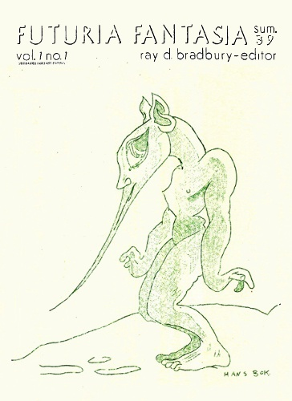<figcaption><a class="foo-source" href="https://commons.wikimedia.org/wiki/File:Futuria_Fantasia,_no._1_cover.jpg" target="_blank" rel="noopener">Wikimedia</a></figcaption></figure>

Foo E. Onyaa pseudonym in Ray Bradbury’s zine Futuria Fantasia, 1939

And, coincidently, why SHOULD Mr. Onya take such pains to be unpleasent in print? … Does he think that any real lover of sci-fic gives a damn whether there is one less reader, especially a reader who crawls behind such a silly pseudonym as “Onya”?
<a class="foo-source" href="https://www.gutenberg.org/files/41627/41627-h/41627-h.htm" target="_blank" rel="noopener">Henry Hasse · Futuria Fantasia, Winter 1940</a>

</section>
<section class="foo-piece kind-image font-type tone-ochre" id="foo-dragon-ball-fu" data-item="dragon-ball-fu">

<figure data-pick="c0"><figcaption>
FuDragon Ball Xenoverse 2
<a class="foo-source" href="https://dragonball.fandom.com/wiki/Fu" target="_blank" rel="noopener">Dragon Ball Wiki</a></figcaption></figure>

</section>
<section class="foo-piece kind-mixed font-mono tone-sage" id="foo-foo-camp" data-item="foo-camp"><h3 class="foo-name">Foo Camp</h3>

<figure>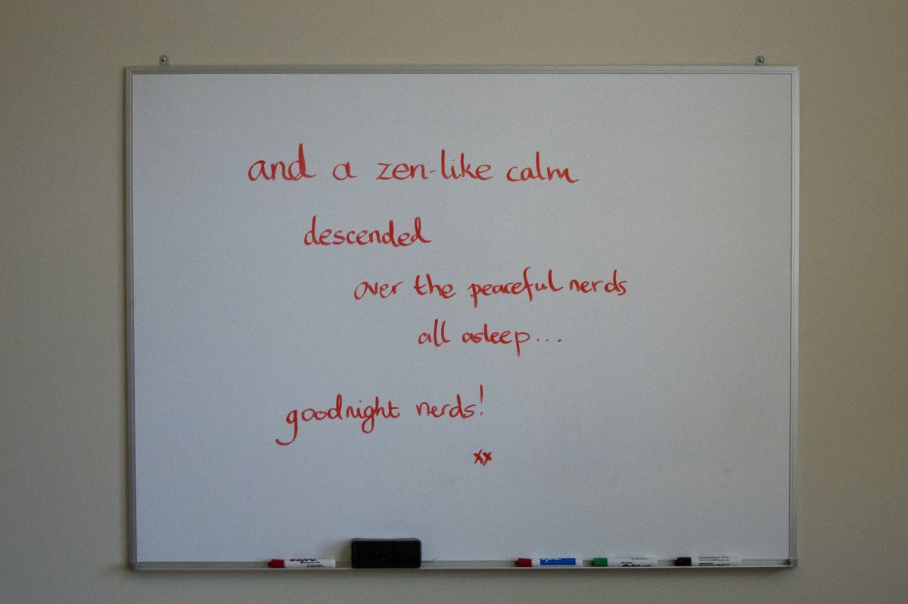<figcaption><a class="foo-source" href="https://commons.wikimedia.org/wiki/File:Goodnight_foocamp_(5829273531).jpg" target="_blank" rel="noopener">Wikimedia</a></figcaption></figure>

Foo CampO’Reilly Media’s unconference

Foo Camp is an annual hacker event hosted by publisher O'Reilly Media. The event started as a joke between Tim O'Reilly and Sara Winge, O'Reilly's VP of Corporate Communications. Sara had always wanted to run a foo bar, an open bar for Friends of O'Reilly, at one of O'Reilly's conferences.
<a class="foo-source" href="https://en.wikipedia.org/wiki/Foo_Camp" target="_blank" rel="noopener">Wikipedia</a>

</section>
<section class="foo-piece kind-mixed font-sans tone-slate foo-logo" id="foo-foo-go" data-item="foo-go"><h3 class="foo-name">Foo Go</h3>

<figure><figcaption><a class="foo-source" href="https://en.wikipedia.org/wiki/File:Foo_Go_company_logo.png" target="_blank" rel="noopener">Wikipedia</a></figcaption></figure>

Foo GoUK sandwich brand

Foo Go was a brand of pre-packed sandwiches and other convenience food. Foo Go operated on a "zero waste" policy and has used water-based boards, inks, and coatings with packet windows made from cornstarch instead of the normal oil-based inks and plastic film to make the containers biodegradable.
<a class="foo-source" href="https://en.wikipedia.org/wiki/Foo_Go" target="_blank" rel="noopener">Wikipedia</a>

</section>
<section class="foo-piece kind-mixed font-mono tone-sage" id="foo-rfc1037-foo" data-item="rfc1037-foo"><h3 class="foo-name">Error code: FOO</h3>

<figure data-pick="c1">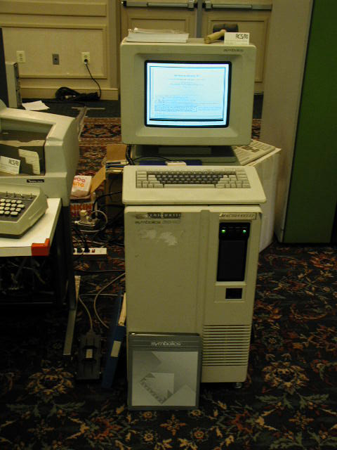<figcaption><a class="foo-source" href="https://commons.wikimedia.org/wiki/File:Symbolics3640.JPG" target="_blank" rel="noopener">Wikimedia</a></figcaption></figure>

Error code: FOO

FOO   File open for output.  Opening a file that was already opened for output was attempted.
<a class="foo-source" href="https://www.rfc-editor.org/rfc/rfc1037.txt" target="_blank" rel="noopener">RFC 1037 · 1987</a>

</section>
<section class="foo-piece kind-mixed font-sans tone-umber" id="foo-foobar-backdoor" data-item="foobar-backdoor"><h3 class="foo-name">FooBaR</h3>

<figure>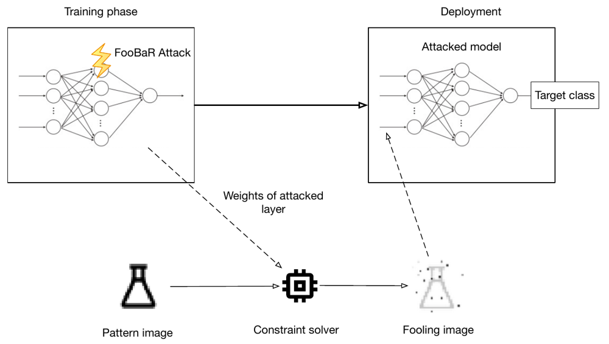<figcaption><a class="foo-source" href="https://arxiv.org/abs/2109.11249" target="_blank" rel="noopener">arXiv · Fig. 1</a></figcaption></figure>

FooBaRFault Fooling Backdoor Attack on Neural Network Training

In particular, we discuss attacks against ReLU activation functions that make it possible to generate a family of malicious inputs, which are called fooling inputs, to be used at inference time to induce controlled misclassifications.
<a class="foo-source" href="https://arxiv.org/abs/2109.11249" target="_blank" rel="noopener">Breier, Hou, Ochoa &amp; Solano · arXiv, 2021</a>

</section>
<section class="foo-piece kind-image font-type tone-ochre" id="foo-foocubus" data-item="foocubus"><h3 class="foo-name">foocubus</h3>

<figure data-pick="c2">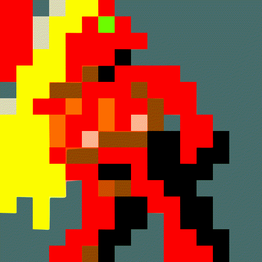<figcaption><a class="foo-source" href="https://nethackwiki.com/wiki/File:Succubus.png" target="_blank" rel="noopener">NetHack Wiki</a></figcaption></figure>

foocubusNetHack

foocubus (plural foocubi, derived from foo) refers to either one or both a pair of monsters that can be encountered in the dungeon: the incubus, &amp;, and the succubus, &amp;.
<a class="foo-source" href="https://nethackwiki.com/wiki/Foocubus" target="_blank" rel="noopener">NetHack Wiki</a>

</section>
<section class="foo-piece kind-mixed font-book tone-terracotta" id="foo-univac-fubar" data-item="univac-fubar"><h3 class="foo-name">“Put the fubar on top.”</h3>

<figure data-pick="c1">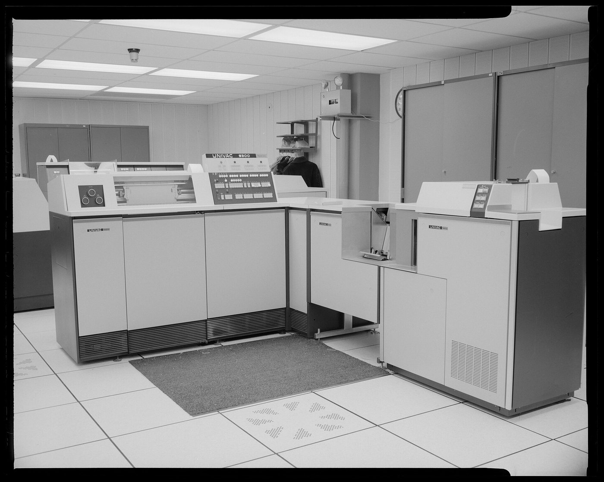<figcaption><a class="foo-source" href="https://commons.wikimedia.org/wiki/File:UNIVAC_system_(unidentified)_printer_and_card_reader,_by_the_U.S._Army_Natick_Soldier_Systems_Center,_December_10,_1973,_from_the_Digital_Commonwealth_-_data_analysis_office,_UNIVAC_system_-_commonwealth_zk51zm256.jpg" target="_blank" rel="noopener">Wikimedia</a></figcaption></figure>

“Put the fubar on top.”

He taped a sign, &quot;This thing is FUBAR&quot;, on the metal weight that sits on the stack of unread cards. The sign stayed there for over a year. One day, somebody said, &quot;Don't forget to put the fubar on top of the stack&quot;. It stuck! We called that weight the fubar until they took away the machine.
<a class="foo-source" href="http://foldoc.org/fubar" target="_blank" rel="noopener">FOLDOC</a>

</section>
<section class="foo-piece kind-text font-book tone-sage" id="foo-ja-fuufu" data-item="ja-fuufu">

夫婦

fūfu · [ɸɯːɸɯ]

Japanese · noun

husband and wife; a married couple

夫婦喧嘩は犬も食わないEven a dog won’t eat a husband-and-wife quarrel. (Stay out of couples’ fights.)

</section>
<section class="foo-piece kind-text font-display tone-umber" id="foo-ja-fufufu" data-item="ja-fufufu">

ふふふ

fufufu · [ɸɯɸɯɸɯ]

Japanese · interj.

a soft, knowing chuckle; hehehe (often mischievous or smug)

</section>
<section class="foo-piece kind-mixed font-book tone-terracotta" id="foo-fu-orionis" data-item="fu-orionis"><h3 class="foo-name">FU Orionis</h3>

<figure data-pick="c1">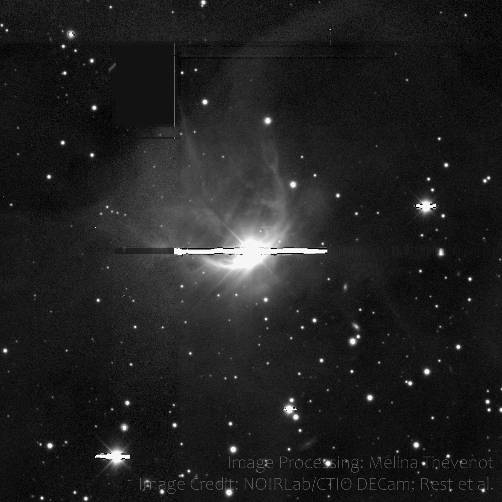<figcaption><a class="foo-source" href="https://commons.wikimedia.org/wiki/File:FU_Orionis_DECam_VR.jpg" target="_blank" rel="noopener">Wikimedia</a></figcaption></figure>

FU Orionisa young star in Orion

FU Orionis is a variable and binary star system in the constellation of Orion, that in 1937 rose in apparent visual magnitude from 16.5 to 9.6, and has since been around magnitude 9.
<a class="foo-source" href="https://en.wikipedia.org/wiki/FU_Orionis" target="_blank" rel="noopener">Wikipedia</a>

</section>
<section class="foo-piece kind-image font-display tone-plum" id="foo-mario-foo" data-item="mario-foo">

<figure data-pick="c0"><figcaption>
FooNew Super Mario Bros. Wii, 2009
<a class="foo-source" href="https://www.mariowiki.com/Foo" target="_blank" rel="noopener">Super Mario Wiki</a></figcaption></figure>

</section>
<section class="foo-piece kind-mixed font-type tone-umber" id="foo-fr-fou" data-item="fr-fou">

<figure data-pick="c4">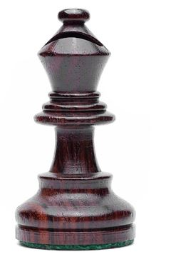<figcaption><a class="foo-source" href="https://chessfox.com/wp-content/uploads/2016/02/bishop-strengths-and-weakness.jpg" target="_blank" rel="noopener">Chessfox</a></figcaption></figure>

fou

fou · /fu/

French · noun (m.)

(chess) bishop; also: madman; jester (court entertainer); (colloq.) nut, enthusiast

Un fou peut se déplacer sur n'importe quelle case le long d'une des diagonales sur lesquelles il se trouve.A bishop may move to any square along one of the diagonals on which it stands. (FIDE, Les règles du jeu d'échecs 2023)

Chess sense: from Spanish alfil, from Arabic al-fīl 'elephant; bishop', influenced by fou 'mad/jester'
<a class="foo-source" href="https://en.wiktionary.org/wiki/fou" target="_blank" rel="noopener">Wiktionary</a>

</section>
<section class="foo-piece kind-mixed font-book tone-terracotta" id="foo-foucault" data-item="foucault"><h3 class="foo-name">Michel Foucault</h3>

<figure><figcaption><a class="foo-source" href="https://commons.wikimedia.org/wiki/File:Photo_of_Michel_Foucault_on_1970_dustjacket_of_The_Order_of_Things.jpg" target="_blank" rel="noopener">Wikimedia</a></figcaption></figure>

Michel FoucaultFrench philosopher, 1926–1984

« Ubu rond de cuir » appartient au fonctionnement de l’administration moderne, comme il appartenait au fonctionnement du pouvoir impérial à Rome d’être entre les mains d’un histrion fou.“Ubu the pen-pusher” is part of how modern administration works, just as it was part of how imperial power worked in Rome to be in the hands of a mad ham actor.
<a class="foo-source" href="https://fr.wikiquote.org/wiki/Michel_Foucault" target="_blank" rel="noopener">Les Anormaux, lecture of 8 January 1975</a>

</section>
<section class="foo-piece kind-text font-mono tone-umber" id="foo-github-users" data-item="github-users"><h3 class="foo-name">@foobar</h3>

GitHub accounts

<a class="foo-gh-link" href="https://github.com/foobar" target="_blank" rel="noopener">@foobar</a>user #5,953 · joined 9 April 2008

<a class="foo-gh-link" href="https://github.com/foo" target="_blank" rel="noopener">@foo</a>user #33,384 · joined 8 November 2008

<a class="foo-gh-link" href="https://github.com/bar" target="_blank" rel="noopener">@bar</a>user #88,155 · joined 25 May 2009

<a class="foo-source" href="https://api.github.com/users/foobar" target="_blank" rel="noopener">GitHub API</a>

</section>
  

  

<section class="foo-piece kind-text font-type tone-ochre" id="foo-foo-foo-1837" data-item="foo-foo-1837"><h3 class="foo-name">A foo-foo, or an outsider</h3>

A foo-foo, or an outsider

Don't know what a foo-foo is? Well, as you're a greenhorn, I'll enlighten you. A foo-foo, or an outsider, is a chap that can't come the big figure. —A Glance at New York.
<a class="foo-source" href="https://greensdictofslang.com/entry/5qni56q" target="_blank" rel="noopener">Bartlett · Dictionary of Americanisms, 1859</a>

</section>
<section class="foo-piece kind-mixed font-mono tone-slate foo-logo" id="foo-foo-mobi" data-item="foo-mobi"><h3 class="foo-name">Foo Mobi</h3>

<figure><figcaption><a class="foo-source" href="https://foo.mobi/" target="_blank" rel="noopener">foo.mobi</a></figcaption></figure>

Foo Mobifintech company

An Award Winning B2B Software Solutions Fintech Company focused on empowering businesses with in-house built innovative products.  FOO for Banks · FOO for Fintech · FOO for Service Providers · FOO for Central Banks
<a class="foo-source" href="https://foo.mobi/" target="_blank" rel="noopener">foo.mobi</a>

</section>
<section class="foo-piece kind-image font-mono tone-terracotta" id="foo-foobar2000" data-item="foobar2000"><h3 class="foo-name">foobar2000</h3>

<figure data-pick="c0"><figcaption><a class="foo-source" href="https://commons.wikimedia.org/wiki/File:Foobar2000_logo.png" target="_blank" rel="noopener">Wikimedia</a></figcaption></figure>

foobar2000freeware audio player

foobar2000 is an advanced freeware audio player.
<a class="foo-source" href="https://www.foobar2000.org/" target="_blank" rel="noopener">foobar2000</a>

</section>
<section class="foo-piece kind-mixed font-book tone-sage" id="foo-foo-fighters" data-item="foo-fighters"><h3 class="foo-name">Foo Fighters</h3>

<figure><figcaption><a class="foo-source" href="https://commons.wikimedia.org/wiki/File:Glasto2023.jpg" target="_blank" rel="noopener">Wikimedia</a></figcaption></figure>

Foo FightersDave Grohl’s band

Grohl hoped to stay anonymous and release the recordings in a limited run under the name Foo Fighters, taken from foo fighter, a World War II term for unidentified flying objects.
<a class="foo-source" href="https://en.wikipedia.org/wiki/Foo_Fighters" target="_blank" rel="noopener">Wikipedia</a>

</section>
<section class="foo-piece kind-mixed font-book tone-terracotta" id="foo-foo-fighters-1945" data-item="foo-fighters-1945"><h3 class="foo-name">Foo-Fighters, 1945</h3>

<figure>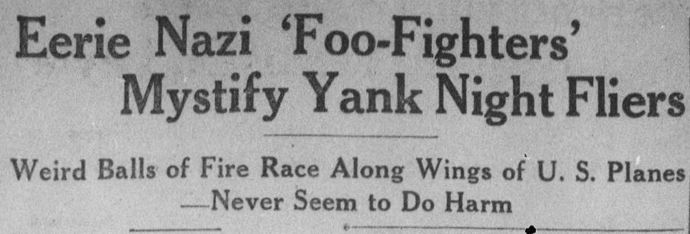<figcaption><a class="foo-source" href="http://www.loc.gov/resource/sn83020847/1945-01-04/ed-1/?sp=5" target="_blank" rel="noopener">Library of Congress</a></figcaption></figure>

“Foo-Fighters”Springfield Weekly Republican, 4 January 1945

A United States Night Fighters Base, France, Jan. 1 — (AP) — The Nazis have thrown something new into the night skies over Germany — the weird, mysterious “foo-fighter,” balls of fire which race alongside the wings of American Beaufighters flying intruder missions over the Reich.
<a class="foo-source" href="http://www.loc.gov/resource/sn83020847/1945-01-04/ed-1/?sp=5" target="_blank" rel="noopener">Chronicling America</a>

</section>
<section class="foo-piece kind-mixed font-display tone-ochre" id="foo-bunny-foo-foo" data-item="bunny-foo-foo">

<figure data-pick="c4">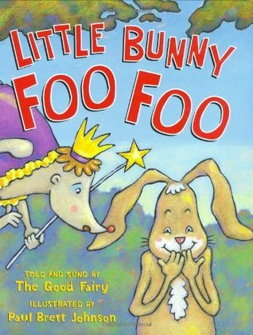<figcaption>
Little Bunny Foo FooPaul Brett Johnson · Scholastic Press, 2004
<a class="foo-source" href="https://www.goodreads.com/book/show/614769" target="_blank" rel="noopener">Goodreads</a></figcaption></figure>

Little Bunny Foo Foo, Hopping through the forest, Scooping up the field mice, And bopping them on the head.
<a class="foo-source" href="https://en.wikipedia.org/wiki/Little_Bunny_Foo_Foo" target="_blank" rel="noopener">Wikipedia</a>

</section>
<section class="foo-piece kind-mixed font-display tone-sage" id="foo-foo-foo-muppet" data-item="foo-foo-muppet"><h3 class="foo-name">Foo-Foo</h3>

<figure>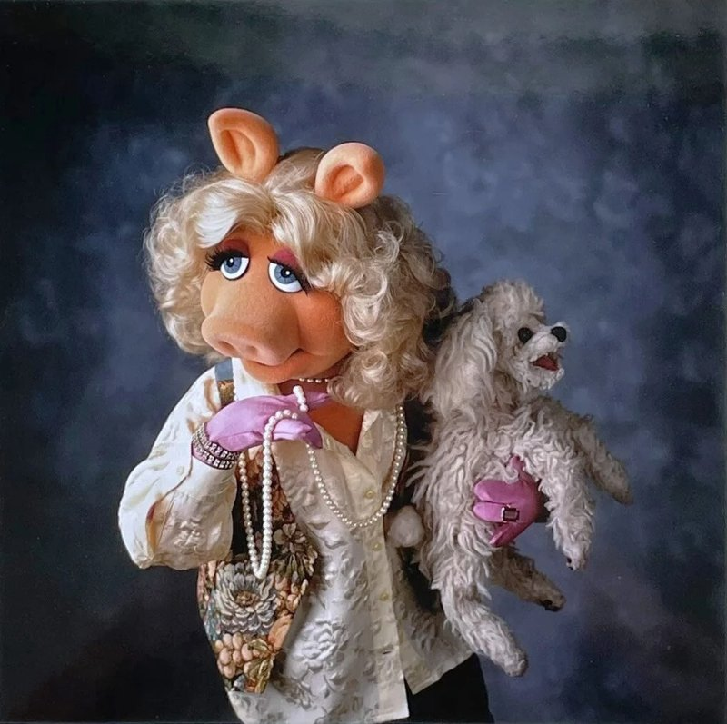<figcaption><a class="foo-source" href="https://muppet.fandom.com/wiki/File:Miss_Piggy_Foo_Foo_pearls.jpg" target="_blank" rel="noopener">Muppet Wiki</a></figcaption></figure>

Foo-FooMiss Piggy’s poodle

Foo-Foo is Miss Piggy's dog, who first appeared in the fourth season of The Muppet Show. She speaks only in barks and other typical dog vocalizations. According to The Muppets Character Encyclopedia, Foo-Foo has siblings named Oui-Oui, Poo-Poo, Num-Num, Goo-Goo, and Fred.
<a class="foo-source" href="https://muppet.fandom.com/wiki/Foo-Foo" target="_blank" rel="noopener">Muppet Wiki</a>

</section>
<section class="foo-piece kind-mixed font-mono tone-umber" id="foo-five-fu" data-item="five-fu"><h3 class="foo-name">5-FU</h3>

<figure data-pick="c0"><figcaption><a class="foo-source" href="https://commons.wikimedia.org/wiki/File:Fluorouracil2DACS.svg" target="_blank" rel="noopener">Wikimedia</a></figcaption></figure>

5-FUfluorouracil, a chemotherapy drug

CID 3385
Molecular formula
C4H3FN2O2
Molecular weight
130.08
IUPAC name
5-fluoro-1H-pyrimidine-2,4-dione
<a class="foo-source" href="https://pubchem.ncbi.nlm.nih.gov/compound/Fluorouracil" target="_blank" rel="noopener">PubChem</a>

</section>
<section class="foo-piece kind-mixed font-mono tone-terracotta" id="foo-google-foobar" data-item="google-foobar"><h3 class="foo-name">foo.bar</h3>

<figure>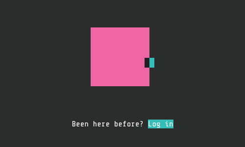<figcaption><a class="foo-source" href="https://web.archive.org/web/20190522042142/https://foobar.withgoogle.com/" target="_blank" rel="noopener">Wayback Machine · 2019</a></figcaption></figure>

foo.barGoogle’s secret hiring challenge

Google Foobar is a secret way of recruiting top developers and programmers from around the world. It includes challenges occurring instantly on the screen of the developer when they search for some specific keywords related to coding.
<a class="foo-source" href="https://www.turing.com/kb/foobar-google-secret-hiring-technique" target="_blank" rel="noopener">Turing</a>

</section>
<section class="foo-piece kind-image font-sans tone-plum" id="foo-foo-foo-racehorse" data-item="foo-foo-racehorse">

<figure data-pick="c4">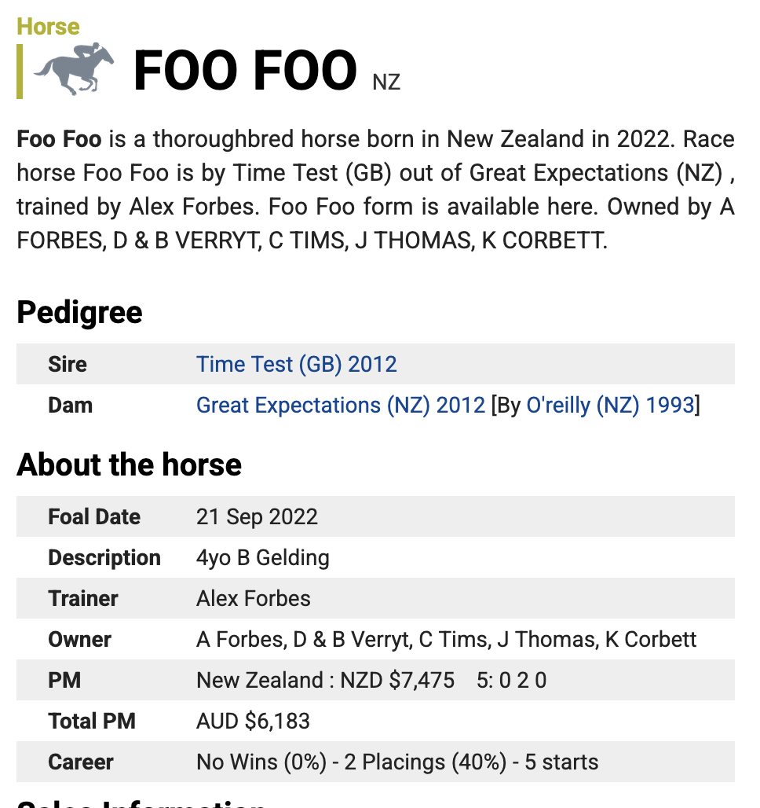<figcaption>
Foo FooNZ · racehorse
<a class="foo-source" href="https://www.racingandsports.com.au/thoroughbred/horse/foo-foo/2343452" target="_blank" rel="noopener">Racing and Sports</a></figcaption></figure>

</section>
<section class="foo-piece kind-mixed font-sans tone-slate" id="foo-foobar-zero" data-item="foobar-zero"><h3 class="foo-name">Foobar Zero</h3>

<figure><figcaption><a class="foo-source" href="https://store.steampowered.com/app/2841320/Foobar_Zero/" target="_blank" rel="noopener">Steam</a></figcaption></figure>

Foobar Zeroa video game, 2025

Foobar Zero is a fast-paced multiplayer shooter game, with anime characters. Customize your characters with various outfits, create your own loadout with futuristic guns and swords, and dominate your enemies with superior movement!
<a class="foo-source" href="https://store.steampowered.com/app/2841320/Foobar_Zero/" target="_blank" rel="noopener">Steam</a>

</section>
<section class="foo-piece kind-mixed font-book tone-terracotta" id="foo-foo-bars" data-item="foo-bars"><h3 class="foo-name">Foo Bar</h3>

Foo Barrestaurants and bars named Foo Bar

<figure class="foo-venue"><figcaption>Foo BarCharlotte, North CarolinaLevel up at Foo Bar—Charlotte’s modern arcade and cocktail bar.<a class="foo-source" href="https://www.foobarclt.com/play" target="_blank" rel="noopener">foobarclt.com</a></figcaption></figure><figure class="foo-venue"><figcaption>Foo BarMelbourne, FloridaSip handcrafted cocktails at Foo Bar, a stylish cocktail lounge in downtown Melbourne, FL.<a class="foo-source" href="https://foobarmelbourne.com/" target="_blank" rel="noopener">foobarmelbourne.com</a></figcaption></figure><figure class="foo-venue">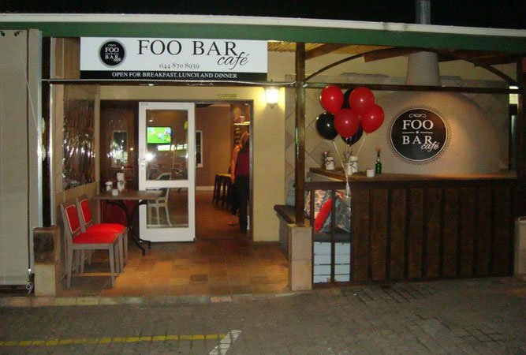<figcaption>Foo Bar CafeGeorge, South AfricaFor a trendy spot at which almost nothing is predictable, Foo Bar Cafe in George is a definite winner.<a class="foo-source" href="https://blog.sa-venues.com/provinces/garden-route/foo-bar-cafe/" target="_blank" rel="noopener">SA-Venues</a></figcaption></figure><figure class="foo-venue">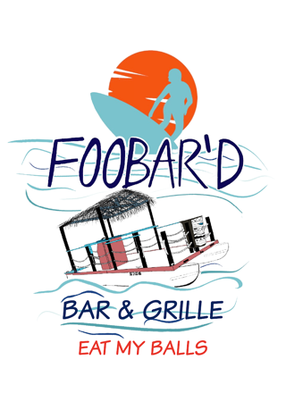<figcaption>Foobar’d Bar &amp; GrilleAnderson, South CarolinaFamily owned Tiki style bar and grille based off of our food truck.<a class="foo-source" href="https://nextdoor.com/pages/foobard-bar-grille-anderson-sc/" target="_blank" rel="noopener">Nextdoor</a></figcaption></figure>

</section>
<section class="foo-piece kind-mixed font-type tone-sage" id="foo-foofoo" data-item="foofoo"><h3 class="foo-name">FooFoo</h3>

<figure>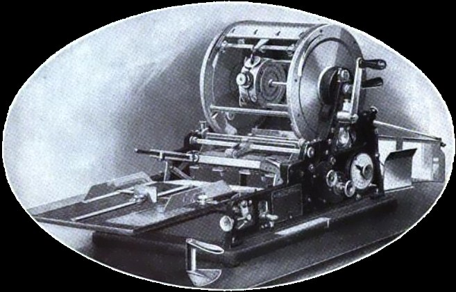<figcaption><a class="foo-source" href="https://commons.wikimedia.org/wiki/File:Mimeograph,_1918.png" target="_blank" rel="noopener">Wikimedia</a></figcaption></figure>

FooFooghod of mimeography, 1938

Foo, or FooFoo, the second fannish Ghod, proclaimed by Pogo in 1938. Foo was embodied on earth as Jack Speer, author of the first Fancyclopedia. The holy color of Foo is black, as Foo is a ghod of mimeography. The Sacred Order was sometimes called the Black Legion.
<a class="foo-source" href="https://fancyclopedia.org/Foo-Foo" target="_blank" rel="noopener">Fancyclopedia 3</a>

</section>
<section class="foo-piece kind-mixed font-type tone-terracotta" id="foo-paine-phoo" data-item="paine-phoo"><h3 class="foo-name">Phoo, Phoo!</h3>

<figure data-pick="c2">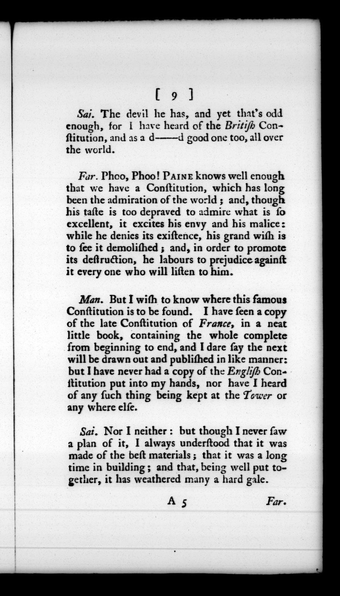<figcaption><a class="foo-source" href="https://archive.org/details/bim_eighteenth-century_dialogues-on-the-rights-_bowles-john_1792" target="_blank" rel="noopener">Internet Archive</a></figcaption></figure>
<figure data-pick="c3"><figcaption><a class="foo-source" href="https://commons.wikimedia.org/wiki/File:Thomas_Paine_by_Laurent_Dabos.jpg" target="_blank" rel="noopener">Wikimedia</a></figcaption></figure>

Phoo, Phoo!John Bowles on Thomas Paine, 1792

Phoo, Phoo! Paine knows well enough that we have a Constitution, which has long been the admiration of the world; and, though his taste is too depraved to admire what is so excellent, it excites his envy and his malice.
<a class="foo-source" href="https://archive.org/details/bim_eighteenth-century_dialogues-on-the-rights-_bowles-john_1792" target="_blank" rel="noopener">John Bowles · Dialogues on the Rights of Britons, 1792</a>

</section>
<section class="foo-piece kind-image font-display tone-ochre" id="foo-aw-phooey" data-item="aw-phooey"><h3 class="foo-name">Aw, phooey!</h3>

<figure>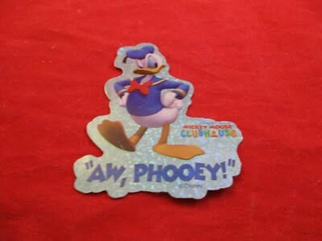<figcaption>
Aw, phooey!Donald Duck’s catchphrase
<a class="foo-source" href="https://encrypted-tbn0.gstatic.com/images?q=tbn:ANd9GcQodxVB9WTwpZy0PzbjSA7HqxZXi7Y2bBwgncoE-5alfHvUI2BIt1zIqrOf&amp;s=10" target="_blank" rel="noopener">Google Images</a></figcaption></figure>

</section>
<section class="foo-piece kind-mixed font-book tone-umber" id="foo-ru-fu-ty-nu-ty" data-item="ru-fu-ty-nu-ty">

<figure data-pick="c2"><figcaption><a class="foo-source" href="https://commons.wikimedia.org/wiki/File:Udalyje_molodcy_mid_18_cent.jpg" target="_blank" rel="noopener">Wikimedia</a></figcaption></figure>

фу-ты ну-ты

fu-ty nu-ty · [ˈfu tɨ ˈnu tɨ]

Russian · interjectional phrase (разг.)

with exclamatory intonation, expresses surprise, irony and similar feelings

...палка с серебряным набалдашником – просто фу-ты ну-ты, важная персона!...a cane with a silver knob – la-di-da, a big shot! (Russian translation of Twain, Huckleberry Finn, 1884; example via kartaslov.ru)
<a class="foo-source" href="https://ru.wiktionary.org/wiki/%D1%84%D1%83-%D1%82%D1%8B_%D0%BD%D1%83-%D1%82%D1%8B" target="_blank" rel="noopener">Wiktionary</a>

</section>
<section class="foo-piece kind-mixed font-type tone-plum" id="foo-adventure-foobar" data-item="adventure-foobar"><h3 class="foo-name">FEE FIE FOE FOO</h3>

<figure data-pick="c2">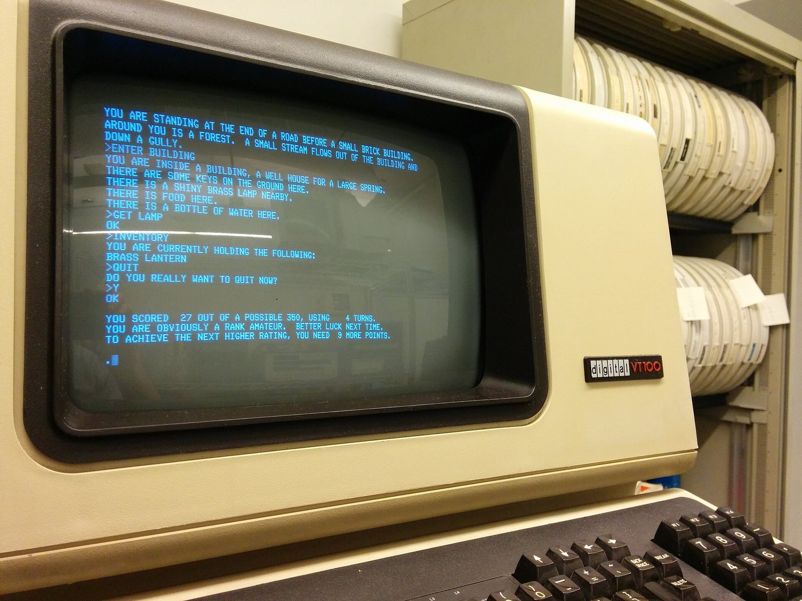<figcaption><a class="foo-source" href="https://commons.wikimedia.org/wiki/File:Colossal_Cave_Adventure_on_VT100_terminal.jpg" target="_blank" rel="noopener">Wikimedia</a></figcaption></figure>

FEE FIE FOE FOOColossal Cave Adventure, 1977

C  FOOBAR  CURRENT PROGRESS IN SAYING &quot;FEE FIE FOE FOO&quot;.
<a class="foo-source" href="https://github.com/kristopherjohnson/advent/blob/master/advent.for" target="_blank" rel="noopener">Colossal Cave Adventure · 1977</a>

</section>
<section class="foo-piece kind-mixed font-sans tone-terracotta" id="foo-financial-foo" data-item="financial-foo"><h3 class="foo-name">The FOO</h3>

<figure><figcaption><a class="foo-source" href="https://moneyguy.com/faq/what-is-the-financial-order-of-operations-foo/" target="_blank" rel="noopener">Money Guy</a></figcaption></figure>

The FOOFinancial Order of Operations

The Financial Order of Operations, or FOO, as it is most commonly called, is our 9-step system designed to help you decide what to do with your next dollar.
<a class="foo-source" href="https://moneyguy.com/faq/what-is-the-financial-order-of-operations-foo/" target="_blank" rel="noopener">Money Guy</a>

</section>
<section class="foo-piece kind-mixed font-book tone-plum" id="foo-ru-fu" data-item="ru-fu">

<figure data-pick="c2"><figcaption><a class="foo-source" href="https://commons.wikimedia.org/wiki/File:Farnos_the_Red_Nose_and_his_wife_Pegasya.JPG" target="_blank" rel="noopener">Wikimedia</a></figcaption></figure>

фу

fu · [fu]

Russian · interj.

pew!, ew!, yuck! (expresses disgust); phew! (relief); (dog command) stop that!

Фу, какая гадость!Ugh, how disgusting!
<a class="foo-source" href="https://en.wiktionary.org/wiki/%D1%84%D1%83" target="_blank" rel="noopener">Wiktionary</a>

</section>
<section class="foo-piece kind-mixed font-book tone-ochre" id="foo-fooz-formation" data-item="fooz-formation"><h3 class="foo-name">Fooz Formation – FOO</h3>

<figure>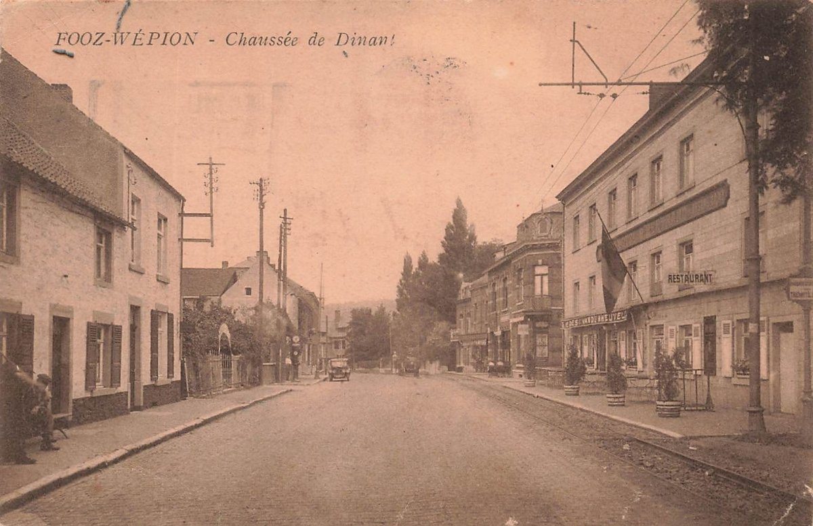<figcaption><a class="foo-source" href="https://commons.wikimedia.org/wiki/File:FOOZ-WÉPION_-_Chaussée_de_Dinant.jpg" target="_blank" rel="noopener">Wikimedia</a></figcaption></figure>

Fooz Formation – FOOLower Devonian rock, Belgium

Origin of name. Section located in the Potisseau River valley at Fooz, a hamlet of Wépion … The Formation rests unconformably on the lower Paleozoic basement and starts with a conglomerate named Ombret Conglomerate.
<a class="foo-source" href="https://popups.uliege.be/1374-8505/index.php?id=7206&amp;lang=en" target="_blank" rel="noopener">Denayer &amp; Mottequin · Geologica Belgica, 2024</a>

</section>
<section class="foo-piece kind-mixed font-mono tone-umber" id="foo-foo-be-mineral" data-item="foo-be-mineral"><h3 class="foo-name">FOO, BE</h3>

<figure data-pick="c4">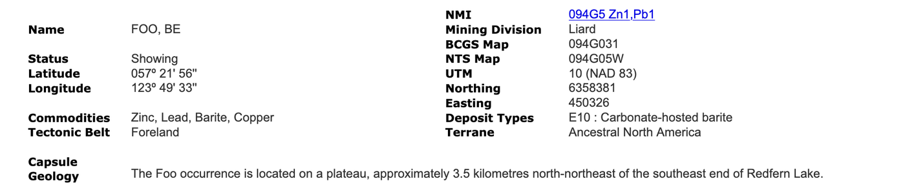<figcaption><a class="foo-source" href="https://minfile.gov.bc.ca/summary.aspx?minfilno=094G%20%20002" target="_blank" rel="noopener">BC MINFILE</a></figcaption></figure>

FOO, BEa mineral showing in British Columbia

094G 002
Name FOO, BE
Mining Division: Liard
BCGS Map: 094G031
Status: Showing
NTS Map: 094G05W
Latitude: 057º 21' 56''
Longitude: 123º 49' 33''
Commodities: Zinc, Lead, Barite, Copper
Deposit Types: E10 : Carbonate-hosted barite
Tectonic Belt: Foreland
Terrane: Ancestral North America
<a class="foo-source" href="https://minfile.gov.bc.ca/Summary.aspx?minfilno=094G++002" target="_blank" rel="noopener">BC MINFILE</a>

</section>
<section class="foo-piece kind-text font-sans tone-terracotta" id="foo-foo-stats" data-item="foo-stats"><h3 class="foo-name">By the numbers</h3>

By the numberscounted 25 September 2026

4,038,656files on GitHub contain the word foobar
<a class="foo-source" href="https://github.com/search?q=foobar&amp;type=code" target="_blank" rel="noopener">GitHub code search · Sept 2026</a>

733of the 9,835 RFCs mention foo. The first was RFC 114, in April 1971.
<a class="foo-source" href="https://www.rfc-editor.org/rfc/rfc114" target="_blank" rel="noopener">RFC Editor</a>

19,356Stack Overflow questions mention foobar
<a class="foo-source" href="https://stackoverflow.com/search?q=foobar" target="_blank" rel="noopener">Stack Exchange API · Sept 2026</a>

0of the 131,152 papers in the ACL Anthology have foobar in the title or abstract
<a class="foo-source" href="https://aclanthology.org/" target="_blank" rel="noopener">ACL Anthology</a>

</section>
<section class="foo-piece kind-mixed font-book tone-slate foo-people" id="foo-famous-foos" data-item="famous-foos"><h3 class="foo-name">Famous Fus and Foos</h3>

Famous Fus and Foos

<figure class="foo-venue"><figcaption>Fu YuanhuiChinese swimmer, b. 1996Olympic bronze in the 100 m backstroke at Rio 2016, where her interviews went viral: “I’ve already spent my supernatural energy!” (我已使出了洪荒之力！)<a class="foo-source" href="https://en.wikipedia.org/wiki/Fu_Yuanhui" target="_blank" rel="noopener">Wikipedia</a> · <a class="foo-source" href="https://commons.wikimedia.org/wiki/File:Fu_Yuanhui,_2015_(cropped).JPG" target="_blank" rel="noopener">photo</a></figcaption></figure><figure class="foo-venue"><figcaption>Marco FuHong Kong snooker playerA three-time ranking event winner: the 2007 Grand Prix, the 2013 Australian Goldfields Open and the 2016 Scottish Open.<a class="foo-source" href="https://en.wikipedia.org/wiki/Marco_Fu" target="_blank" rel="noopener">Wikipedia</a> · <a class="foo-source" href="https://commons.wikimedia.org/wiki/File:Marco_Fu_at_Snooker_German_Masters_(Martin_Rulsch)_2014-01-29_01.jpg" target="_blank" rel="noopener">photo</a></figcaption></figure><figure class="foo-venue"><figcaption>Stephanie Fooradio journalist and author, b. 1987Worked for <i>This American Life</i> and <i>Snap Judgment</i>. Her 2022 memoir, <i>What My Bones Know</i>, is about healing from complex PTSD.<a class="foo-source" href="https://en.wikipedia.org/wiki/Stephanie_Foo" target="_blank" rel="noopener">Wikipedia</a> · <a class="foo-source" href="https://openlibrary.org/works/OL25473797W" target="_blank" rel="noopener">cover</a></figcaption></figure><figure class="foo-venue"><figcaption>Ching Ling FooChinese magician, 1854–1922The stage name of Chee Ling Qua, the first modern East Asian magician to achieve world fame. An American rival copied his act as “Chung Ling Soo.”<a class="foo-source" href="https://en.wikipedia.org/wiki/Ching_Ling_Foo" target="_blank" rel="noopener">Wikipedia</a> · <a class="foo-source" href="https://commons.wikimedia.org/wiki/File:Ching_Ling_Foo.jpg" target="_blank" rel="noopener">photo</a></figcaption></figure>

</section>
<section class="foo-piece kind-mixed font-mono tone-plum" id="foo-foo-of-oberlin" data-item="foo-of-oberlin"><h3 class="foo-name">FOO Of Oberlin</h3>

<figure>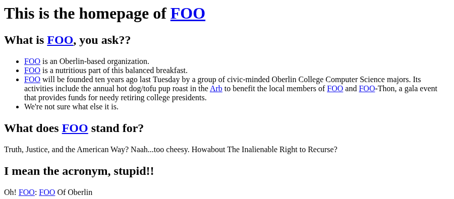<figcaption><a class="foo-source" href="https://sites.cc.gatech.edu/fce/people/jmankoff/FOO/home.html" target="_blank" rel="noopener">Screenshot</a></figcaption></figure>

FOO Of Oberlina recursive acronym

Official motto: The FOO, the Proud, the FOO.  Official FOO operating system: FOOnix, a new version of unix, where all commands are self referential. It saves lots of space that way.
<a class="foo-source" href="https://sites.cc.gatech.edu/fce/people/jmankoff/FOO/home.html" target="_blank" rel="noopener">FOO homepage</a>

</section>
<section class="foo-piece kind-image font-type tone-ochre" id="foo-fu-go" data-item="fu-go">

<figure data-pick="c0">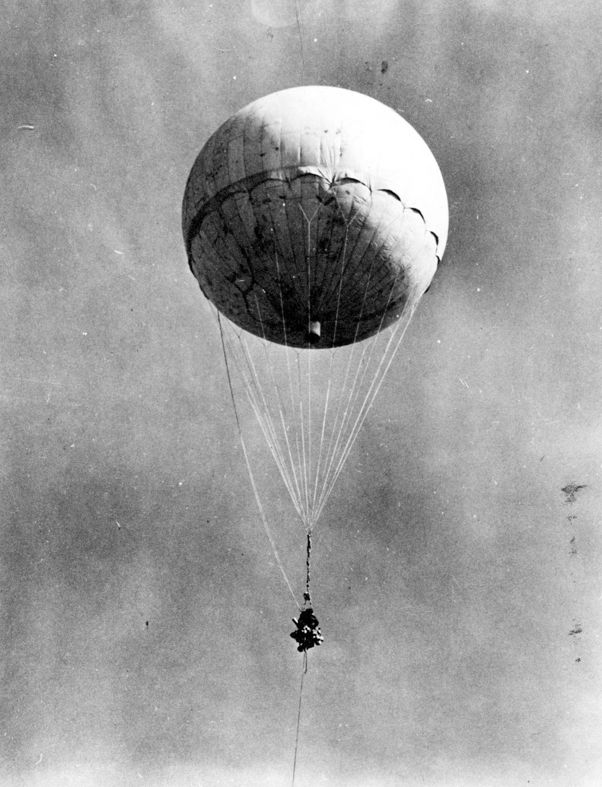<figcaption>
Fu-Goballoon bomb
<a class="foo-source" href="https://commons.wikimedia.org/wiki/File:Japanese_fire_balloon_Moffett.jpg" target="_blank" rel="noopener">Wikimedia</a></figcaption></figure>

</section>
<section class="foo-piece kind-mixed font-book tone-sage" id="foo-foo-lake" data-item="foo-lake"><h3 class="foo-name">Foo Lake</h3>

<figure data-pick="c4">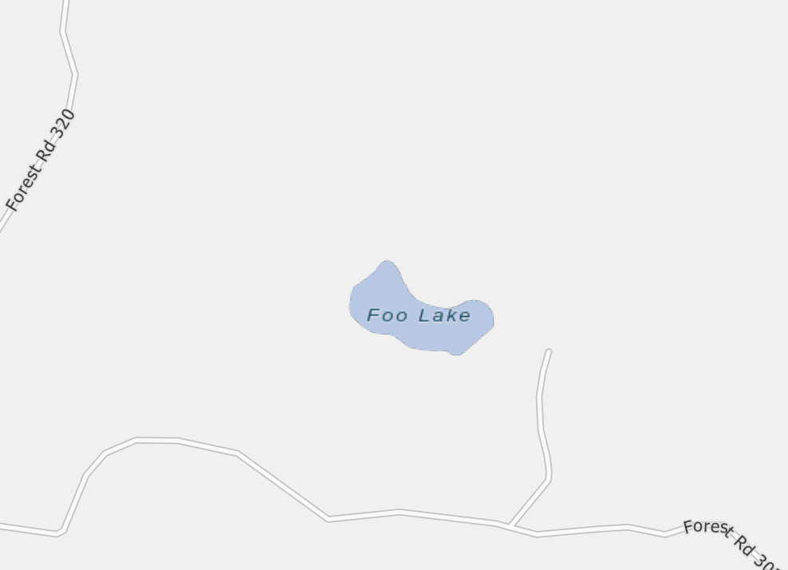<figcaption><a class="foo-source" href="https://apps.dnr.wi.gov/lakes/lakepages/LakeDetail.aspx?wbic=1849400" target="_blank" rel="noopener">Screenshot</a></figcaption></figure>

Foo LakeSawyer County, Wisconsin

Foo Lake is a 4 acre lake located in Sawyer County. It has a maximum depth of 15 feet.
<a class="foo-source" href="https://apps.dnr.wi.gov/lakes/lakepages/LakeDetail.aspx?wbic=1849400" target="_blank" rel="noopener">Wisconsin DNR</a>

</section>
<section class="foo-piece kind-image font-type tone-slate" id="foo-smokey-stover" data-item="smokey-stover">

<figure data-pick="c3">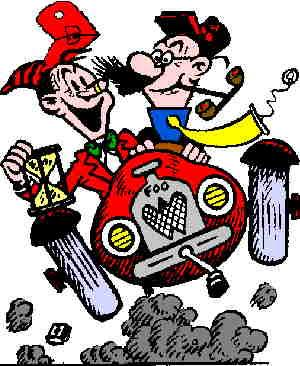<figcaption>
The FoomobileSmokey Stover · Bill Holman’s comic strip
<a class="foo-source" href="https://encrypted-tbn0.gstatic.com/images?q=tbn:ANd9GcRfNYDBHU6IBgto-jEwfnAO4bIgWxnU4Z1lP3tGkAkH0b1M4I2_nM0pN34&amp;s=10" target="_blank" rel="noopener">Google Images</a></figcaption></figure>

</section>
<section class="foo-piece kind-mixed font-type tone-ochre" id="foo-foo-tank" data-item="foo-tank"><h3 class="foo-name">Foo Tank</h3>

<figure>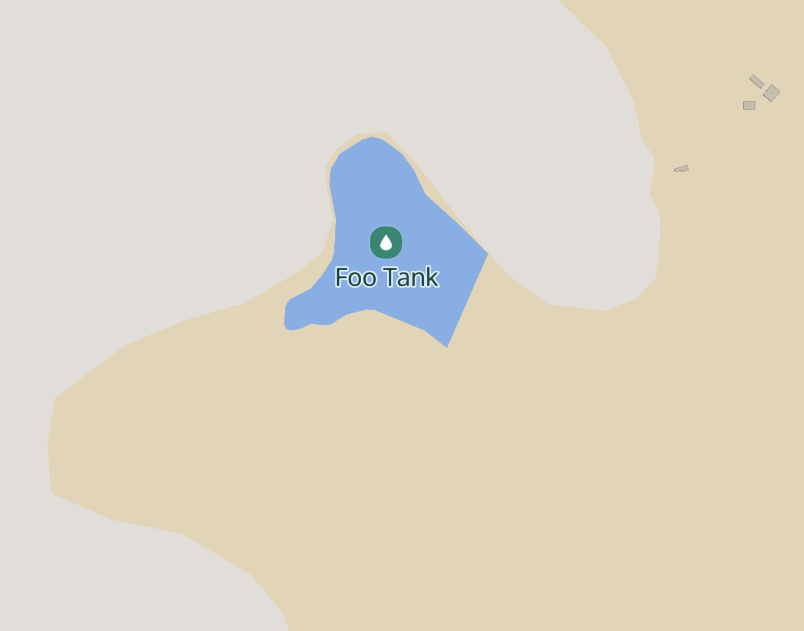<figcaption><a class="foo-source" href="https://arizona.hometownlocator.com/maps/feature-map,ftc,2,fid,4714,n,foo%20tank.cfm" target="_blank" rel="noopener">Map screenshot</a></figcaption></figure>

Foo TankMohave County, Arizona

Foo Tank (in Mohave County, AZ)
Feature Class: Reservoir
GNIS ID 4714
Latitude 35.4219741
Longitude -113.9915363
<a class="foo-source" href="https://arizona.hometownlocator.com/maps/feature-map,ftc,2,fid,4714,n,foo%20tank.cfm" target="_blank" rel="noopener">USGS · HomeTownLocator</a>

</section>
<section class="foo-piece kind-text font-book tone-slate" id="foo-ru-fuflo" data-item="ru-fuflo">

фуфло

fufló · [fʊˈfɫo]

Russian · noun (slang, derogatory)

1. lies, deception; something unreliable or fake; 2. a swindler, a person not respected; 3. something bad, of poor quality

― Ты чего, во все это фуфло веришь?What, you believe all that crap? (Pelevin, Chapaev i Pustota, 1996, via НКРЯ)
<a class="foo-source" href="https://ru.wiktionary.org/wiki/%D1%84%D1%83%D1%84%D0%BB%D0%BE" target="_blank" rel="noopener">Wiktionary</a>

</section>
<section class="foo-piece kind-image font-mono tone-sage" id="foo-foo-iata" data-item="foo-iata">

<figure data-pick="c3">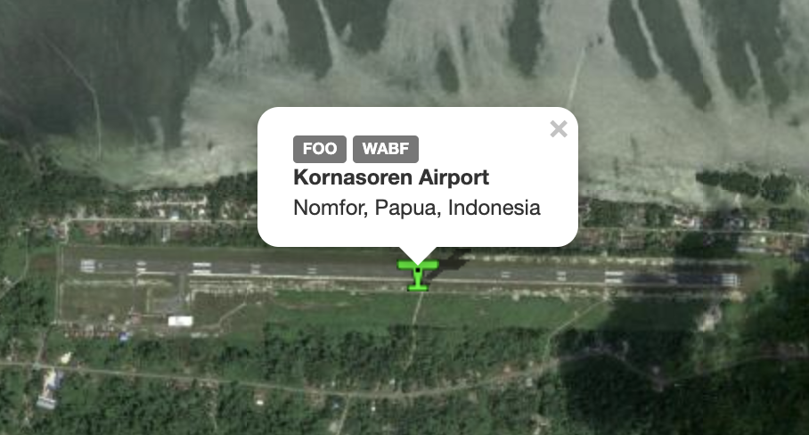<figcaption>
FOOKornasoren Airport · Numfor
<a class="foo-source" href="https://en.wikipedia.org/wiki/Kornasoren_Airport" target="_blank" rel="noopener">Screenshot</a></figcaption></figure>

</section>
<section class="foo-piece kind-mixed font-sans tone-plum" id="foo-farkle" data-item="farkle"><h3 class="foo-name">Foo, the dice game</h3>

<figure>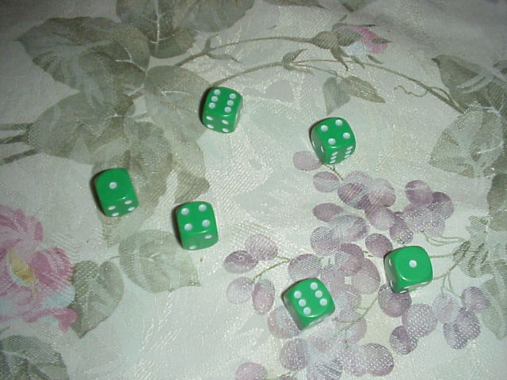<figcaption><a class="foo-source" href="https://commons.wikimedia.org/wiki/File:Farkle_dice.jpg" target="_blank" rel="noopener">Wikimedia</a></figcaption></figure>

Foothe dice game also known as Farkle

6-Dice, 10,000 Dice, or Dice 10,000 is the name of a family dice game, very similar to Farkle. It also goes by other names, including Zilch, Foo, Boxcar, Bogus and Crap Out.
<a class="foo-source" href="https://en.wikipedia.org/w/index.php?title=Dice_10000&amp;oldid=404402247" target="_blank" rel="noopener">Wikipedia · Dice 10000, 2010</a>

</section>
  

In this house, we believe:Foo calls barEvery scratch file is named foo.txtNo variable goes undefinedFoo returns barFoo == fooFoobar is everything

<i></i><i></i>

