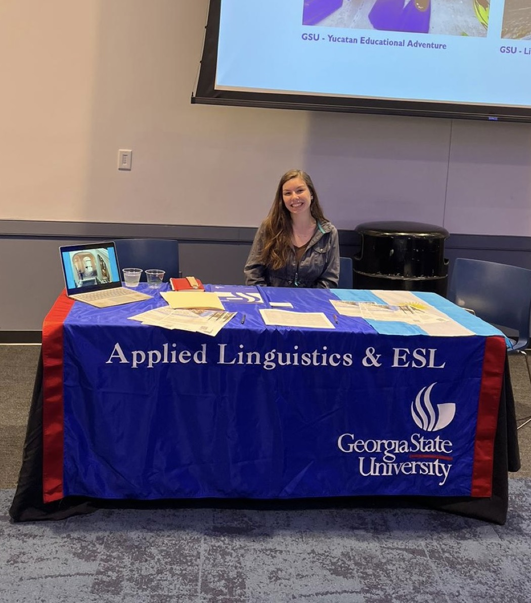
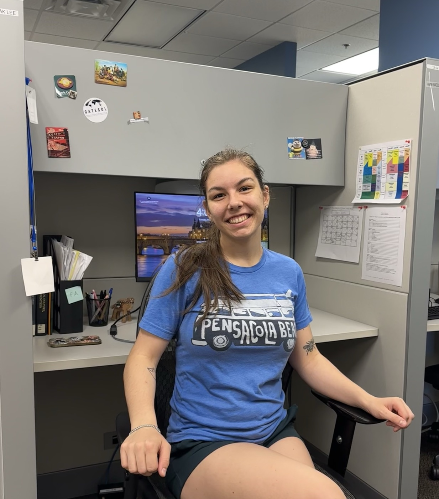

I graduated from Georgia State University with a BA in Applied Linguistics and an undergraduate certificate in EFL. Thank you, GSU, and all in the AL Department.

  <figure>
    
    <figcaption>Manning the AL booth at the study abroad fair.</figcaption>
  </figure>
  <figure>
    
    <figcaption>Shortly before I cleared out my desk in the AL department.</figcaption>
  </figure>

