At the time I am writing this blogpost, I have entered the second year of my master's degree. Per my program's convention, I am now an "advanced" CL MS student, denoting that I am mature, seasoned, acculturated, experienced, et cetera. Bow before me, mere first-years.

All of this is baloney, of course, with the exception that as a second-year, I have made it through one year of graduate school alive and mostly psychologically intact. As someone who made the transition from a pure humanities undergrad program to a STEM MS program, grad school has so far been an explosion of all of my priors, plus an acquisition of a whole new domain of knowledge. It has been terrifying, absurd, thrilling, and illuminating all at once. It has also been one of the best things that has ever happened to me, and that is mostly because of the friends I've made during.

  <figure>
    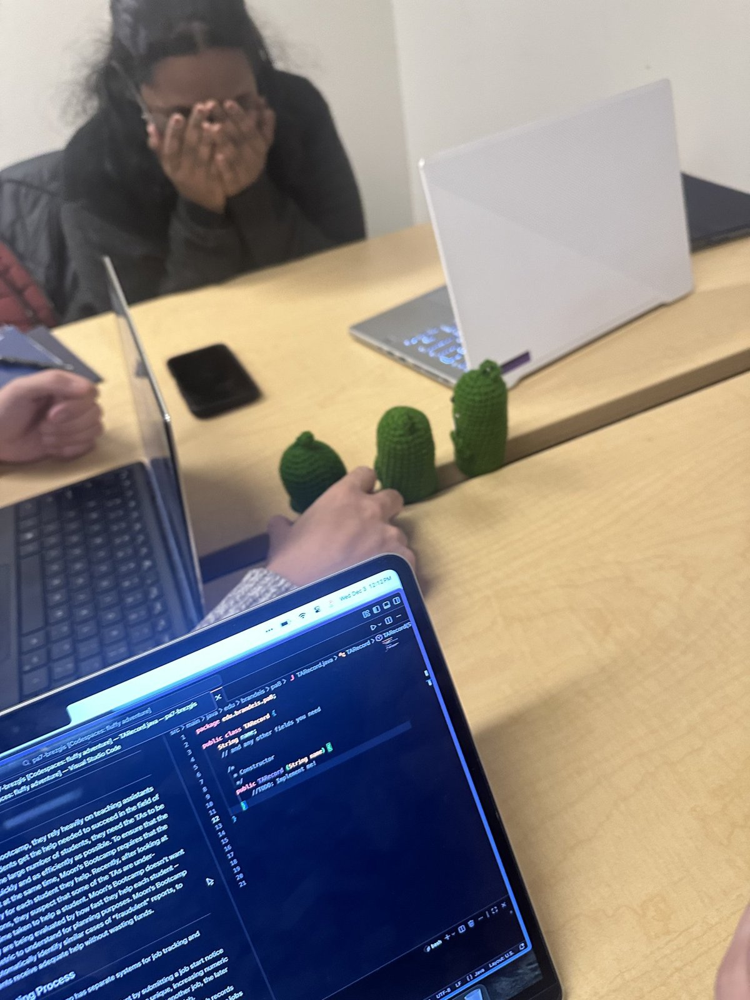
    <figcaption>The hilarity of crochet pickles during homework time in a silent library.</figcaption>
  </figure>
  <figure>
    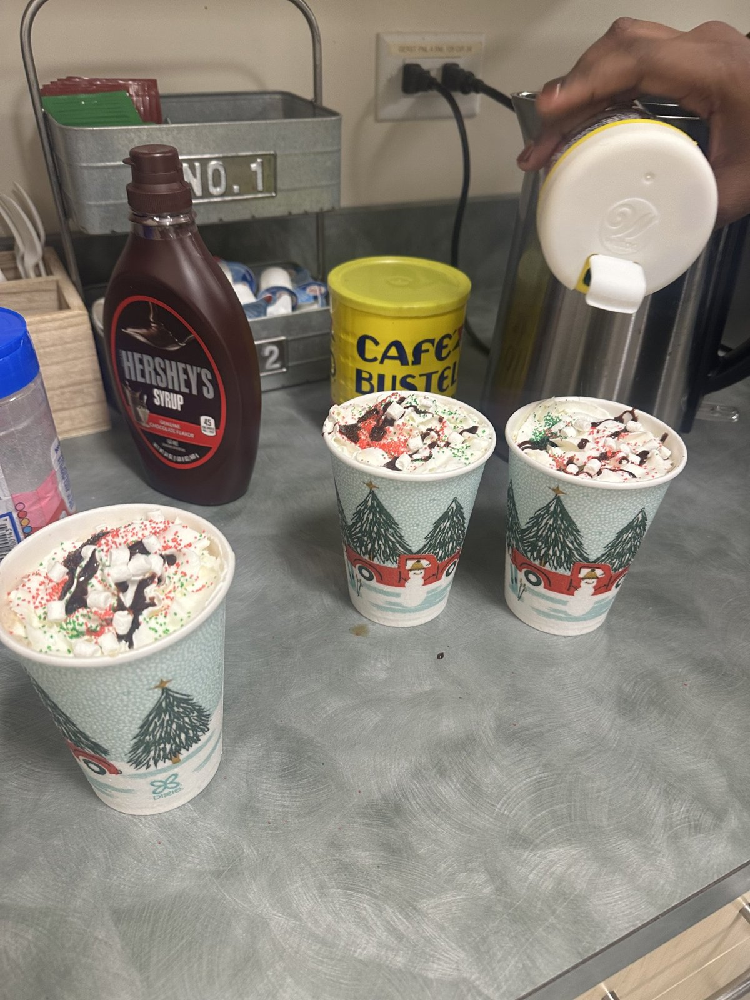
    <figcaption>We were late to class by 5-7 minutes to make these elaborate coffees.</figcaption>
  </figure>

My friend Marc often likens graduate school to a pilgrimage. He completed the Shikoku Henro the summer before starting our program, and often shares stories from his experience as parables for what he learned along the way (more on that later!). The Shikoku Henro consists of 88 Buddhist temples along a 750-mile path that loops around the island of Shikoku. By the end, pilgrims return to their starting point, but never the same as when they began.

Conveniently, the Shikoku pilgrimage has **[four stages](#henro)** which align with the four semesters of a two year master's. We begin with awakening (Fall 1st year, admission), then a stage of ascetic training (Spring 1st year, gaining proficiency in basics), enlightenment (Fall 2nd year, more advanced coursework), and finally nirvana (Spring 2nd year, graduation).

Recently, I went on a mini-pilgrimage with Marc and our friend Sharde. How the story goes, is that Marc was going to a silent meditation retreat in central Massachusetts, and he invited us to bike with him along the Mass Central Rail Trail to about halfway to his final destination. I had just gotten home from travel, and I was jetlagged and exhausted, but I figured that the exercise and sunshine would help me shake it off. I'm going to be using my experience of the rail trail bike ride as a way to talk about the four semesters of graduate school as analogous to the four stages of a pilgrimage. If this sounds convoluted, I assure you that it is.

<aside class="henro" id="henro">
  <h3>The Four Stages of the Shikoku Henro</h3>
  <dl>
    <dt>Tokushima Prefecture (Temples 1–23): Awakening (Hosshin)</dt>
    <dd>The start of the spiritual path, where pilgrims decide to seek truth, symbolized by the awakening of the soul.</dd>
    <dt>Kochi Prefecture (Temples 24–39): Discipline (Shugyō)</dt>
    <dd>A phase of discipline and hardship, training the body and spirit through long walks in nature.</dd>
    <dt>Ehime Prefecture (Temples 40–65): Enlightenment (Bodai)</dt>
    <dd>A period where spiritual understanding deepens, doubts fade, and pilgrims approach enlightenment.</dd>
    <dt>Kagawa Prefecture (Temples 66–88): Nirvana (Nehan)</dt>
    <dd>The final stage, representing liberation from suffering, desire, and ego, achieving a state of profound peace.</dd>
  </dl>
  
See <a href="https://en.wikipedia.org/wiki/Shikoku_Pilgrimage">“Shikoku Pilgrimage,” Wikipedia</a>, and the Shikoku 88 Temple Pilgrimage Association’s guide at <a href="https://88shikokuhenro.jp/en/">88shikokuhenro.jp</a>.

</aside>

## 1. Awakening {#awakening}

The start of the spiritual path, where pilgrims decide to seek truth, symbolized by the awakening of the soul.

On Sunday morning, I was less than 48 hours back from Vietnam, when Marc was leaving for his silent meditation retreat by bike. I had endured the awkward business of loading up my bike on the commuter rail, and was steeling myself with a coffee and a pasty at [my favorite Waltham coffee shop](https://www.commongoodwaltham.com/). I was scrolling my phone and sipping my drink at the high top bar by the window (the canon seat for individual patrons), when a person came up and sat immediately next to me in the empty chair.

I looked low cautiously, then looked up, and it was Marc! He saw my surprise and laughed immediately, and it was the lovely illusion of no time having passed at all between good friends. We chatted and ate more pastries, then biked a few blocks down to his house, where everyone would be departing in the afternoon.

So we stood under the covered porch, as rain had started around us, and we talked about the journey to come.

"So, what do you think you're going to learn? Are you going to experience ego death? Encounter the secrets of the universe?"  
"I honestly have no idea what to expect. I've never done anything like this before. I'm not even sure I'm going to make it to the end."

Reader, this conversation has a beautiful parallel to the beginning weeks of a new graduate program. At our orientation, all of us were scared, awkward, on our absolute best behavior. Many of us felt like we were about to do something great or at least worthwhile, but questioned our validity in the program. My first semester, I had recurring stress dreams about failing out of the program. Notably, one dream where my NLP I professor told me I was being expelled in an empty parking garage.

"There's no way that you can quit halfway. When you come back to school, everyone's going to be asking about your silent meditation experience. You can't tell them that you gave up!"

It was probably unfair of me to say, because quitting can sometimes be the bravest or best thing you can do, but parts of it rung true. You can't easily escape people asking about your life, and it does feel better to have a sympathetic and true answer. Every first-year makes a LinkedIn or social media post about their excitement to begin such a program. Especially for international students or students with loans, a graduate program, once officially committed, can feel genuinely do-or-die.

We talked a bit more about random things, all the while the rain grew in intensity. Sharde had joined us, and we double-checked our provisions, and we all agreed to go out in the rain, and not wait for it to pass.

<figure>
  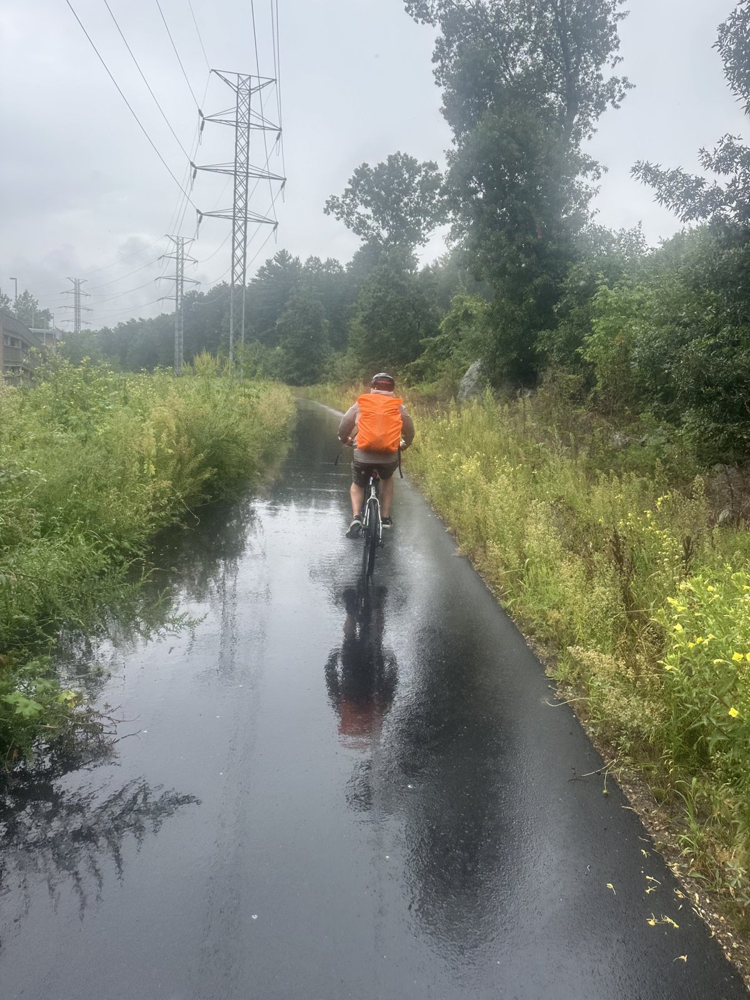
  <figcaption>Off we go, in the rain!</figcaption>
</figure>

The beginning was like, well, being outside in the rain. The first part is exhilarating and whimsical. You feel like a free spirit, connected with your essential humanity and the natural world. Like dancing in the rain, or swimming in the rain (especially at the beach!), it was all laughter, lightness, "woohoo", but after a while you are just kind of cold and wet and getting a bit tired of it. So we were all soaked to the bone, bike lights flashing pathetically in the downpour, silently begging motorists to notice our little caravan.

And I do think school was like this too. A brief, exultatory couple weeks at the beginning, then getting hit with the reality of learning computer science from scratch, on a fast track. The department is underfunded, the faculty are overworked, the (graduate) students are confused and losing it. It was the experience of looking at contemporary academia through an adult lens and learning it's just [SNAFU](https://en.wikipedia.org/wiki/SNAFU) all the time.

<figure>
  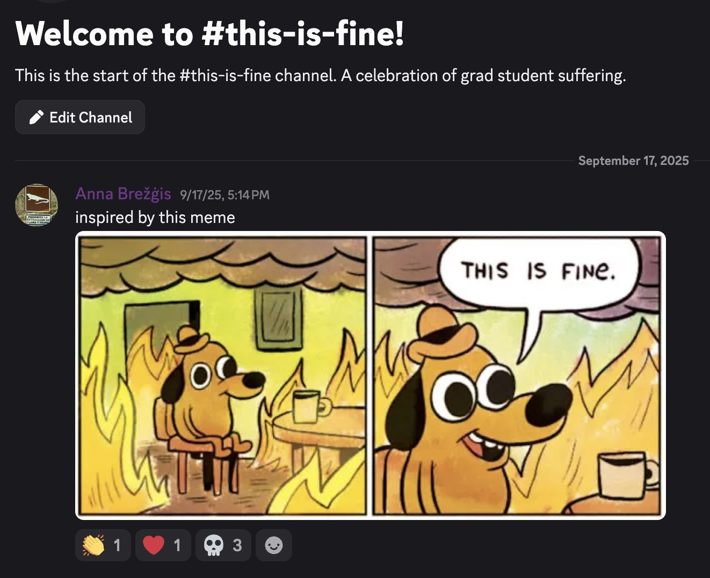
  <figcaption>About a year ago to date, in response to the zeitgeist.</figcaption>
</figure>

We biked across town, and had some trouble finding the trailhead (where Google Maps and All Trails were of little help), but soon we were well and truly off, heading towards the distance on the gravel paths of the official Mass Central Rail Trail.

<figure>
  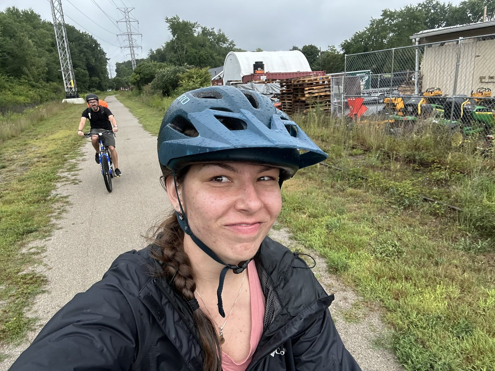
  <figcaption>The author does not condone photographing while biking.</figcaption>
</figure>

## 2. Discipline {#discipline}

A phase of discipline and hardship, training the body and spirit through long walks in nature.

We were somewhere near Wayland when the rain finally cleared. We stopped at an intersection when a long traffic light made us wait, shedding our rain jackets and drinking water. There was a decommissioned train station across the street that had been turned into an antique store. We had traveled here by its arteries.

"How are you guys doing? You're okay?" Marc asked.  
"Yeah, this is great. I've wanted to go this way for a long time," Sharde said.  
"Doing great, this is awesome," I said.

Part of our responses was probably from trying to be good sports, but it really did seem in that moment like everything was okay in the world. Despite the rain, the trail had been beautiful. Dense, yellow wildflowers flanked the trail, and transmission towers stood tall over us like mechs from Star Wars or something. We had passed under not one, but two bridges. It was fun and beautiful and wild.

<figure>
  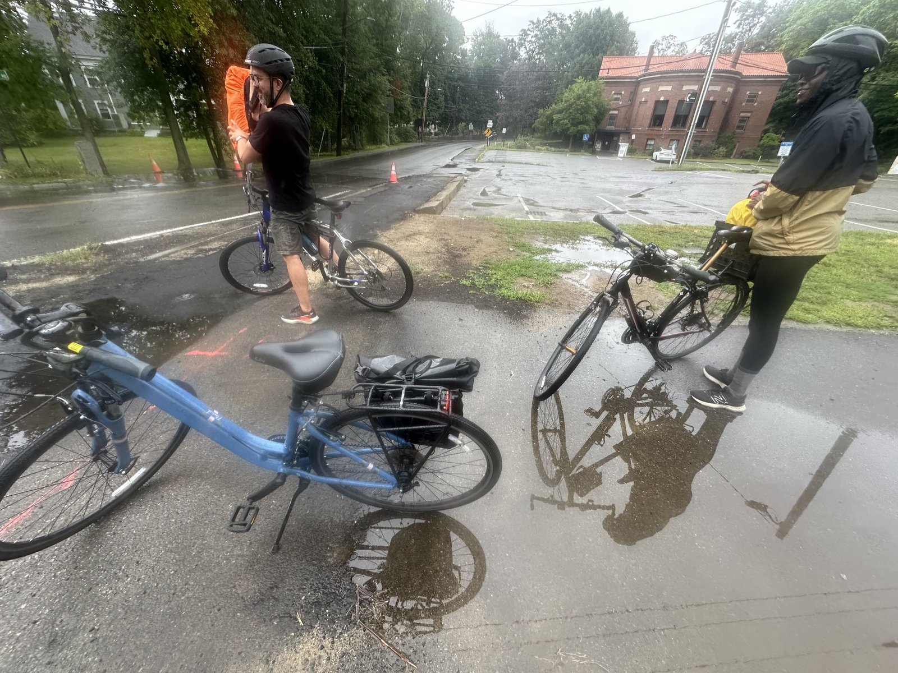
  <figcaption>Regrouping at the big intersection.</figcaption>
</figure>

But we were wet and soggy still, and this led Marc to telling the story of Monsoon Day to Sharde (who had not yet heard it). Monsoon Day is the story of a lifetime, the kind that gets told to children and to children's children. On Monsoon Day, the rain didn't stop, nothing went right, and everybody hated their lives. But now it's a story that elicits roaring laughter of schadenfreude and is a symbol of perseverance for everyone who knows it.

I'll retell it here now, with a few direct quotes from Marc himself, and I hope to do it the justice it deserves.

So Marc was doing the Shikoku Pilgrimage by bike with his friend Marek. On this day, they had originally planned to get to temple 24 by the end of the day. They had gotten caught in a storm while on the road, and tried to wait it out under some trees on the side of the highway. Not wanting to lose a day to the rain, they agree to continue on despite the storm. But they end up biking in the direction of the storm all the way to the next temple.

<blockquote class="pullquote">
  
“And so we biked for, like, 8 hours straight in an unending torrent of rain, which is just the most miserable thing ever. And it was just, like, what was going on earlier was just, like that, but just continuously for 8 hours.”

</blockquote>

And the whole time, the two of them take turns being mad at each other and encouraging each other. "I can't believe I'd agree to do this, I should have never gone on this trip with you!" and "C'mon man, we can do it." In Marc's tellings, this is usually the funniest part, because it makes you imagine the misery of the situation that would drive two generally good-spirited best friends to vitriolic bickering.

Just when they think they have reached the top of the hill where the temple is, there's one more peak to go, around a 10% incline. They manage to get to the final temple just in time, right before it closes at 5:30. Luckily, there's one person still there who can give them their temple stamp. They can't really enjoy their victory yet because of the cost, so they leave shortly and head back down to their bikes.

<figure>
  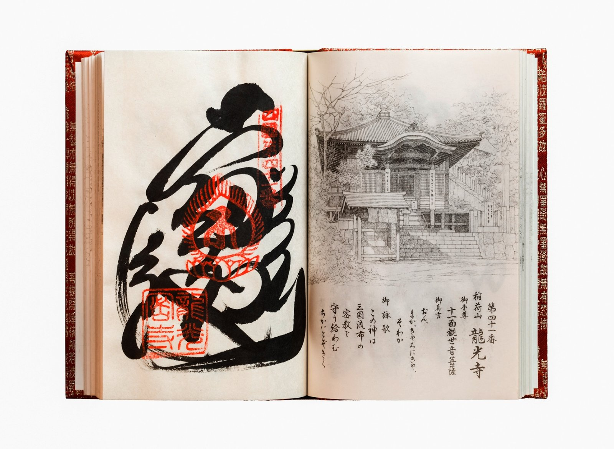
  <figcaption>An example of a pilgrim’s stamp book (<a href="https://i.natgeofe.com/n/9abe5542-18f7-474d-ba74-ef7d24e96045/STOCK_MF4105_2405_GettyImages-1300063209.jpg" target="_blank" rel="noopener">National Geographic</a>)</figcaption>
</figure>

They bike down to the tiny town of Muroto in search of a place to stay for the night. Because they didn't originally plan to go this far, they didn't book anything, and there's few vacancies. The nicest hotel, then the second-nicest hotel is full. By then it's about 6 PM, and it's getting dark, and they're starting to think that they will have to bike to the next town. But the clerk at the second hotel tells them that there is one other place that they can stay. Marek asks, "Is it nice?" and the clerk just looks at them.

So they arrive at the terrible hotel, and as they're given the tour by the owner, they start to realize how awful it is. There's black mold, everything smells like cigarettes, holes in the walls, and "generally looks like it hasn't been cleaned in years". There is also a spider problem, which proves to be the most disturbing part.

But they're soaking wet, exhausted, and defeated, and this is their only option for the next many miles, so they take the room. They end up spending hours drying their belongings with a hair dryer, and leave the lights on all night to watch for the spiders.

<blockquote class="pullquote">
  
“And then he sees the spider, and he really doesn't like spiders. He only freaks out, 'cause it's like, it's like, it's a big, it's a chunky spider. And so he chases it out into the hallway, and he's trying to kill it, and it's really smart. It's like grown some intelligence. And so, it hides behind this fire extinguisher, so he has to grab the fire extinguisher, bang, bang, bang. And then he keeps finding more spiders.”

</blockquote>

So that's Monsoon Day. Marc and Marek biked for 8 hours in the pouring rain, made a steep temple climb, and had a restless, creepy-crawly night of spider patrol. In the morning, there was technically a free breakfast, but it "was terrible" so they left immediately, on to the next temple.

The take-away though can be best summarized by Marc's quote:

<blockquote class="pullquote">
  
“Yeah, my friend... He's like, I can't believe... I can't believe I'm stuck on this island with you. He loved it in the end, though. Yeah, we had a great time in the end.”

</blockquote>

Our Monsoon Day in graduate school probably wasn't a single day (unless we haven't had it yet!) but was more the spirit of stretches of time. Monsoon Day comes in pieces when you are rushing to make a deadline, or have to endure a terrible weed-out class, or trudge through feet of snow from a New England blizzard on your way to class. But you look back, and it's hilarious and special. You are grateful for the experience, and wouldn't have wanted it any other way.

  <figure>
    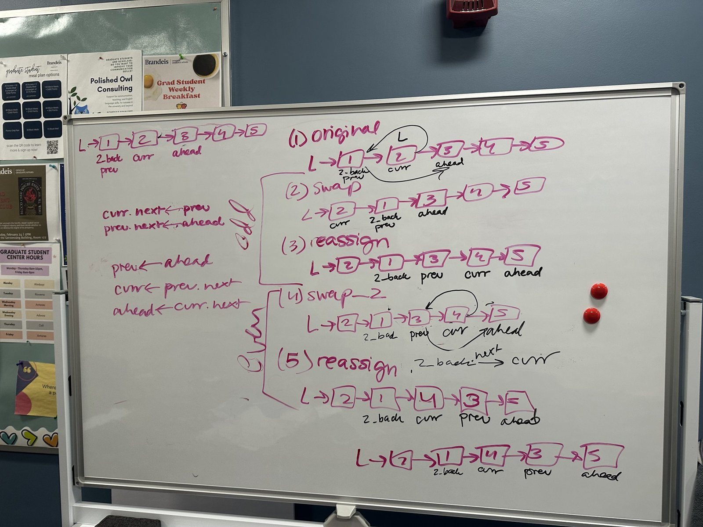
    <figcaption>Mid-process pseudocode for reversing a linked list in place. Don't read this one too closely for accuracy.</figcaption>
  </figure>
  <figure>
    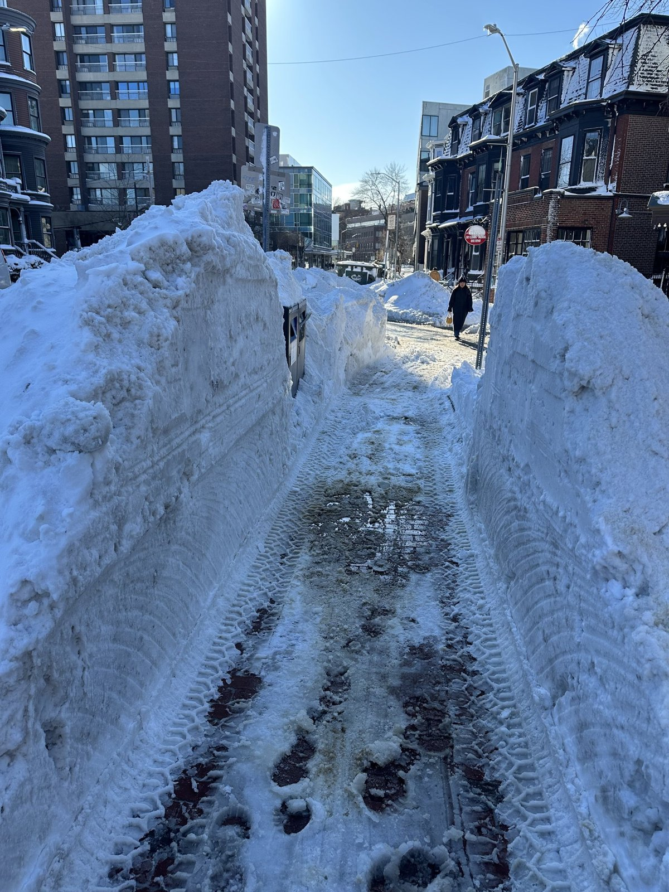
    <figcaption>Schlepping across Cambridge and to school in this weather.</figcaption>
  </figure>

On the trail, little did we know, our Monsoon Day was yet to come. We had set off from the intersection in good spirits, and for about a mile or so, it was just regular trail. But when we come to the next intersection, looking for the continuation of the trail, we can't quite find it.

There's a moment of fumbling with maps and Google searches, when we realize that the section connecting this part to the rest of the rail trail is only "planned". "Planned" meaning that there has been no construction, no clearing. Not even the defunct railroad track has been removed from the ground yet. So, we try to get creative and go around.

We try to go through over by a garden center, which leads to a dead end. And later try to go through a back road, but get scared by the "no trespassing" signs and turn back around.

<figure>
  

    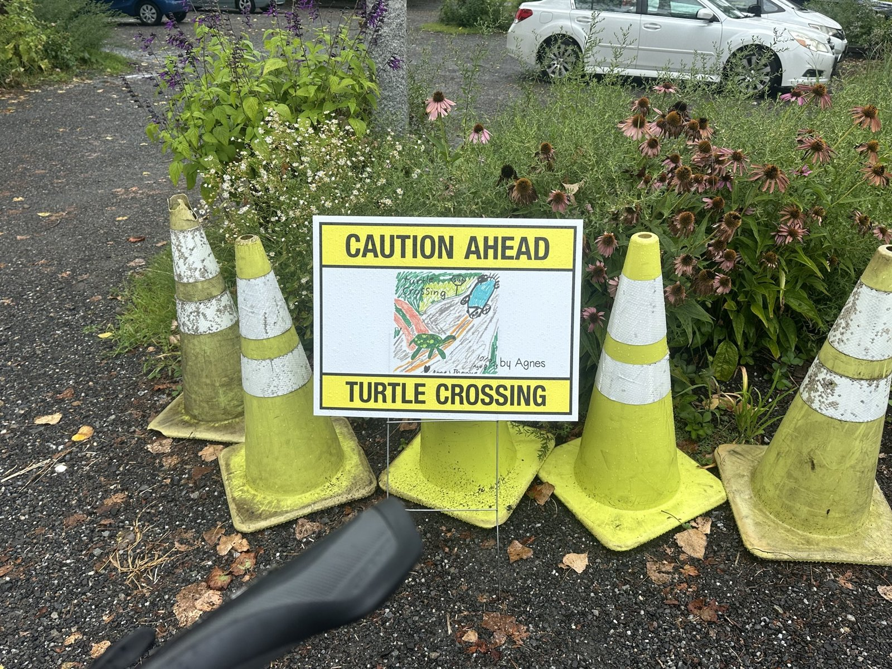
    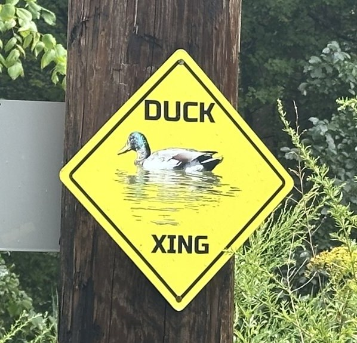
    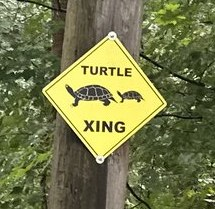
    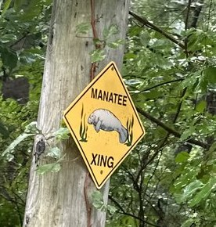
    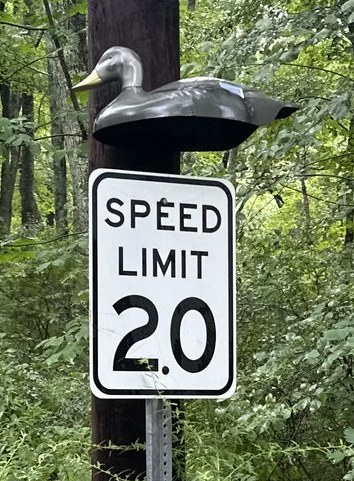
    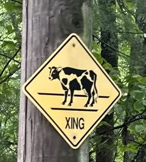
  

  <figcaption>I did see many great <a href="animal-signs.html">animal crossing signs</a>, though I suspect some of these may not be actually reflective of the local fauna.</figcaption>
</figure>
Without any other options, we ride a couple miles on the side of the road, the traffic roaring past us in the opposite direction. I don't know exactly how long this lasted, nor do I remember much of it at all, as I was squarely focused on riding flush with the side of the road, each instantaneous moment ticking into the next. But later the open road fed into a town, and we passed by the familiar sights of small-town civilization: car dealerships, gas stations, fast food restaurants.

<figure>
  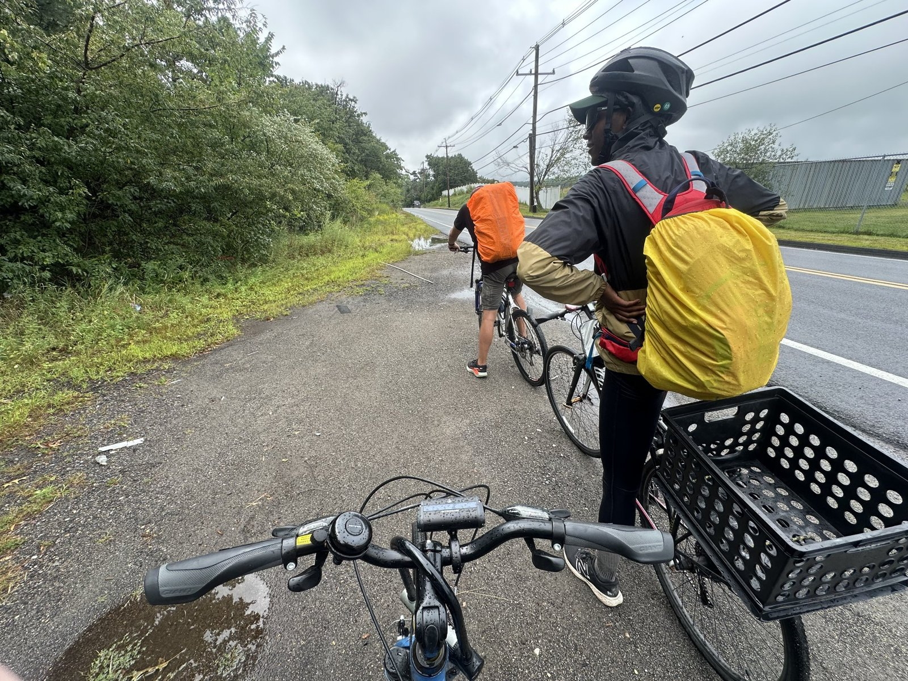
  <figcaption>Checking directions on the side of the road.</figcaption>
</figure>

<figure>
  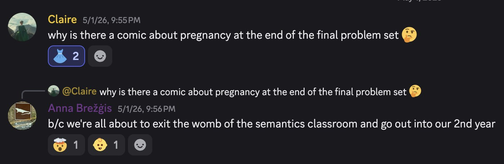
  <figcaption>You can tell I was just getting into psychoanalytic theory around this time.</figcaption>
</figure>

## 3. Enlightenment {#enlightenment}

A period where spiritual understanding deepens, doubts fade, and pilgrims approach enlightenment.

We rode across a boardwalk type-thing, over water carpeted by lily pads. We stopped for a moment to chat and snack on trail mix. Then a couple more minutes of riding, and ahead of us was pure rail trail, connected through the rest of our journey.

  <figure>
    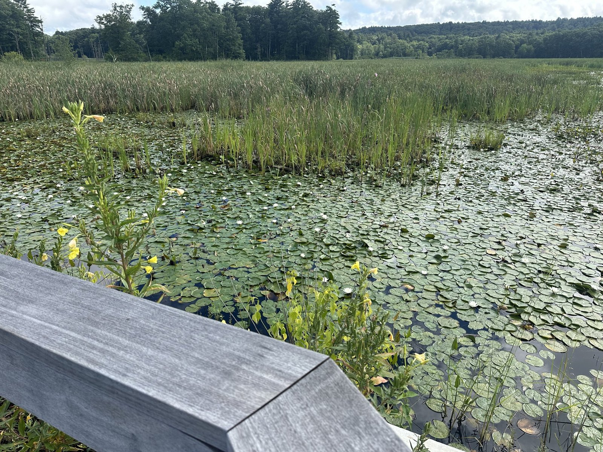
    <figcaption>I could not find a single frog sitting on a lily pad here!</figcaption>
  </figure>
  <figure>
    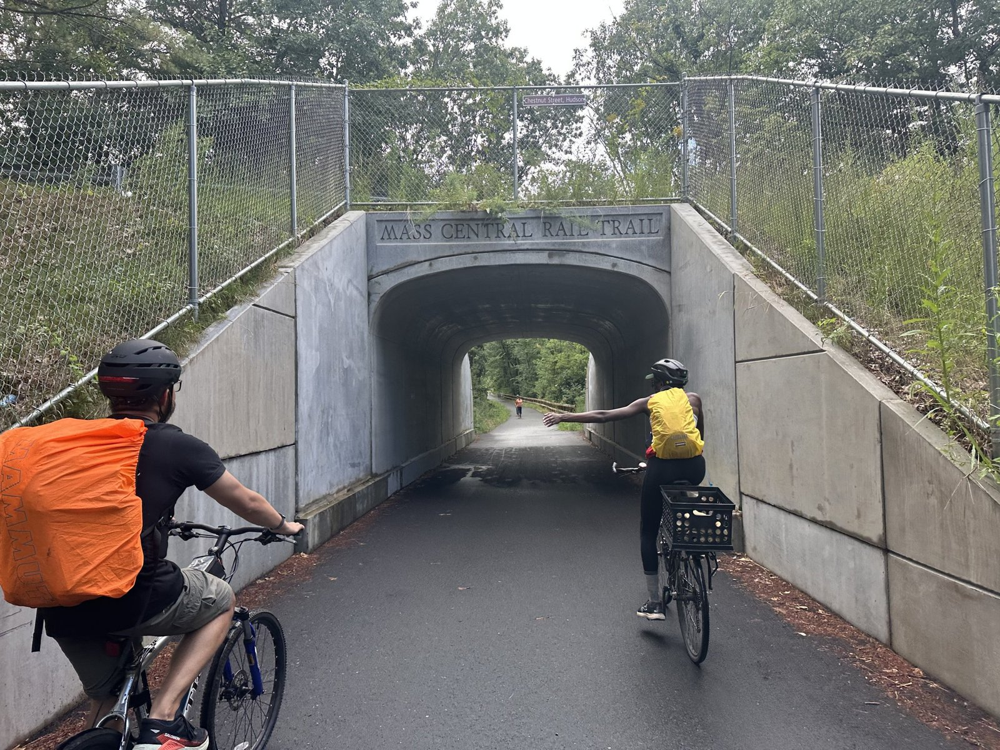
    <figcaption>Tunnneeeeellll!</figcaption>
  </figure>

"Do you remember when you said that that was supposed to be the most beautiful part of the trail?"

Remembering what Marc said immediately before the highway section, we laugh as we coast along the path, again paved, canopied by trees, and dappled with afternoon light. It was a bit absurd, the "most beautiful" actually the most dangerous. But I could imagine it being so in a couple of years when the connecting section is finished. There's a marshy stream, and what seemed like a whole plain of golden tallgrass. It would have been nice to bike through.

  <figure>
    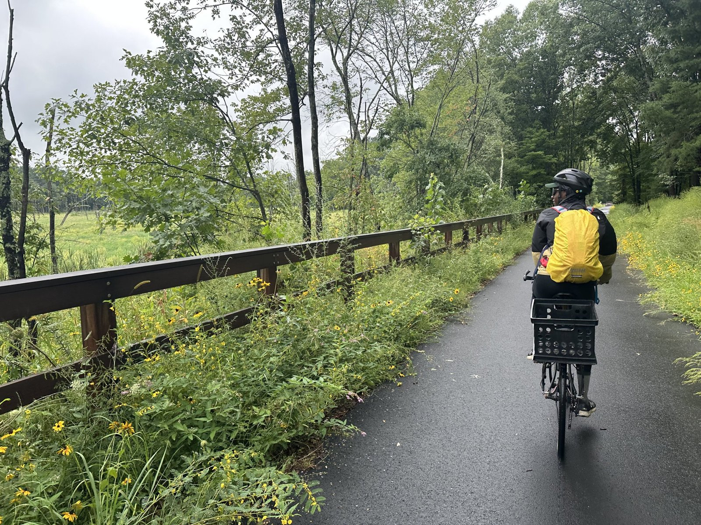
    <figcaption>Everything green and yellow and bright.</figcaption>
  </figure>
  <figure>
    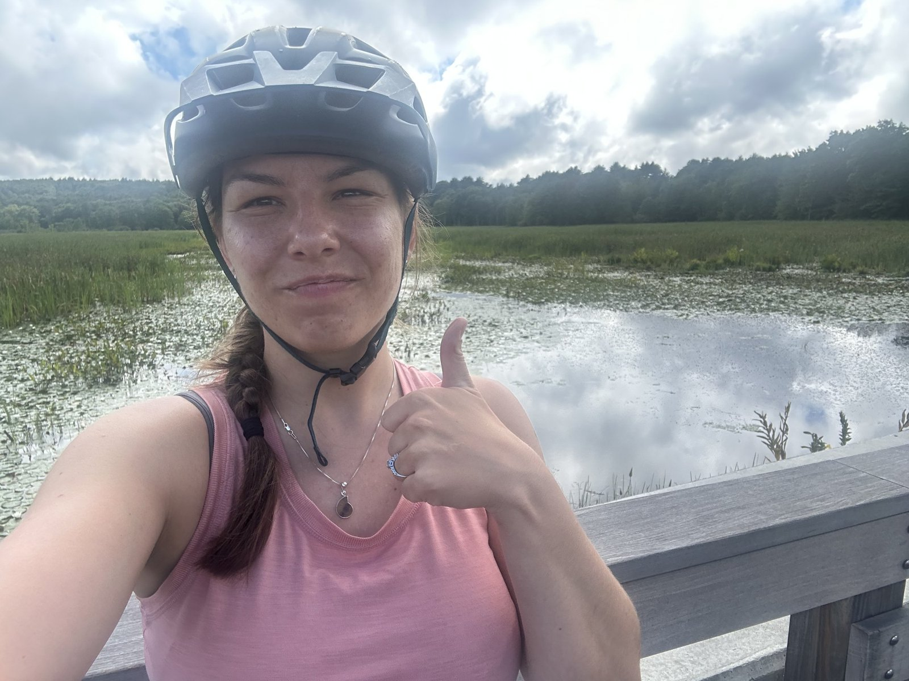
    <figcaption>This post is sponsored by Massachusetts swamps.</figcaption>
  </figure>

There's not much more to say about the bike ride. We rode and talked, a little triangle of bikes instead of a straight line. We arranged and re-arranged ourselves in permutations of three as we dispersed and reformed to let other bikers or walkers pass. We ended up finally in Hudson, Massachusetts, where we had [flatbread pizza](https://www.railtrailflatbread.com/) and then [deep-frozen ice cream](https://newcitymicrocreamery.com/). Marc left the other way, to continue on to his retreat, while Sharde and I rode back towards home.

Recalling that I am now an *advanced* CLMS student, I joke about this title, but it does feel partially true. I have a working, *graduate* per se, level of understanding of the field and its current problems. I am forming my own specific questions and developing familiarity with the appropriate methods. This year is coming with very little of the existential dread of the first year because I am, above all odds, finding identity and belonging here.

I have really loved watching all of us in my cohort becoming our own people. We're all different, but somehow more ourselves. 

And funnily enough, in graduate school, I think enlightenment is not an "I know!" but an "I don't know!" with the same joy and peace as the former. Not knowing means a body of novel literature before you, or an interesting research question, or a conversation to be had. "I know" comes to support the "I don't know" and on and on forever. That is learning and progress.

## 4. Nirvana {#nirvana}

The final stage, representing liberation from suffering, desire, and ego, achieving a state of profound peace.

I can't say exactly what this part is like for graduate school, because I haven't experienced it yet. I also didn't experience the true end of the trail, because Sharde and I only rode as far back as the four corner point at the beginning of [section 3](#enlightenment). Is nirvana when your partner comes to pick you up in a Zipcar?

Whatever it was, it was a relief and it was a clear signal of the day being *over*. We had to take the front wheels off of the bikes to fit them in the Zipcar, which was a minivan, but they both fit, and we were soon homebound, back to Waltham to drop off Sharde, then back to Cambridge.

<figure>
  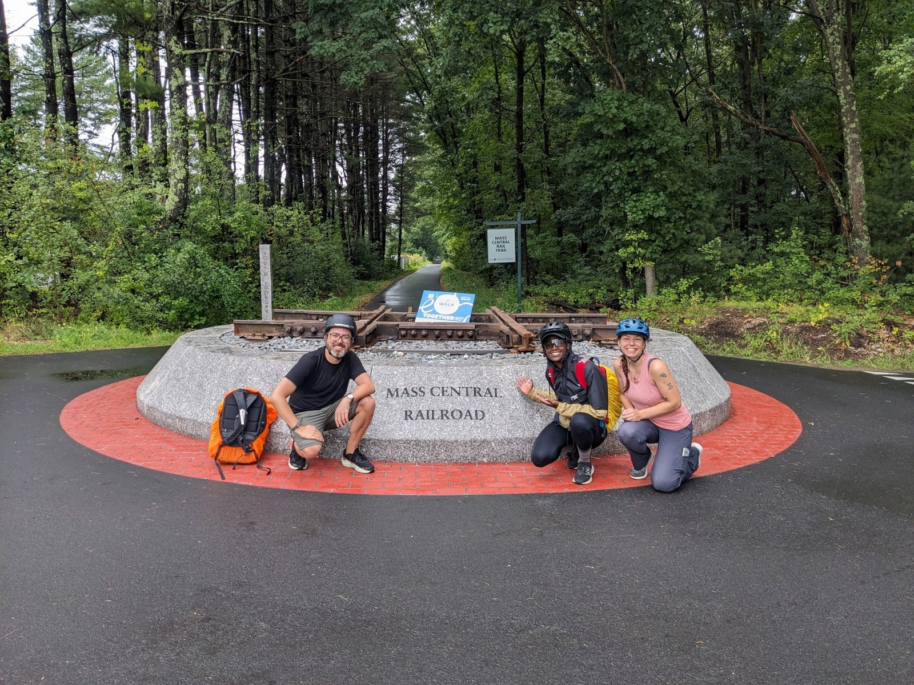
  <figcaption>A beautiful day, thanks guys!</figcaption>
</figure>

My jet lag was catching up to me again, and I was exhausted in the car. We stopped at the grocery store to pick up a few things. I had already eaten in Hudson, and I was fading fast, so I basically just took a shower, and went straight to bed at about 8:30.

But the thing I am realizing now, aware of the approaching end of my time at Brandeis, is that nothing lasts forever. Not only does nothing last forever, but nothing at all seems to last very long. Life is short and graduate programs are even shorter. Like the Shikoku Henro, we return to the place we began (as a new grad), but forever changed, hopefully with hard-earned wisdom and a new appreciation for this life.

The lows (the Monsoon Days) can be a ladder to the highs. Though miserable at the time, if you push through them, there may be laughter and relief on the other side. There can also be deep rest and recovery. I say, bring on the storm.

<figure>
  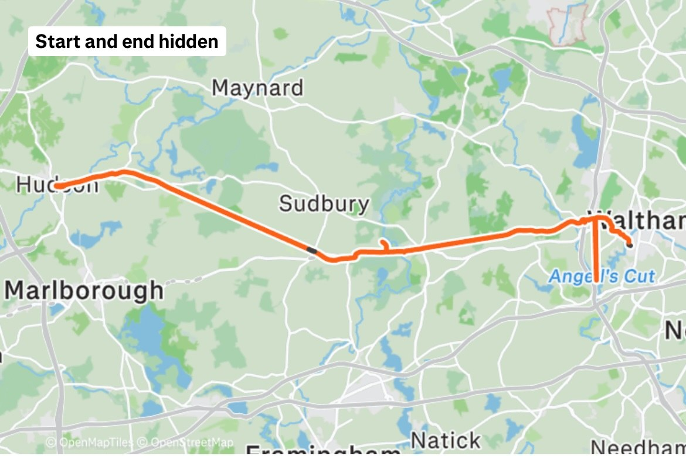
  <figcaption>Route map courtesy of Sharde</figcaption>
</figure>
