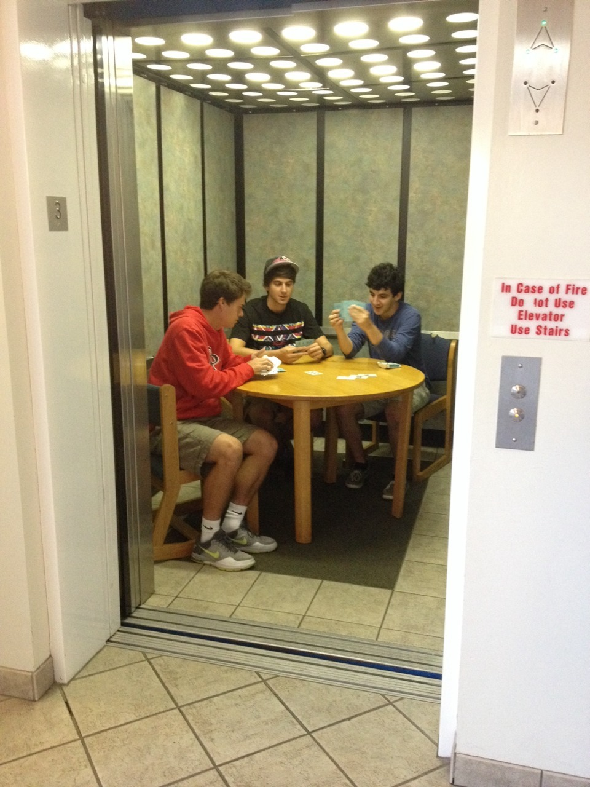
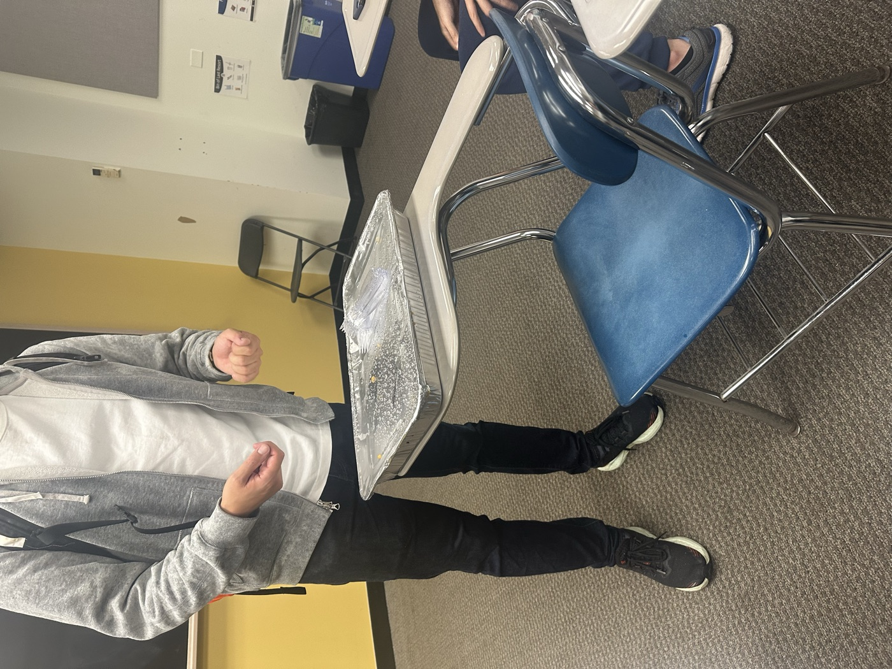
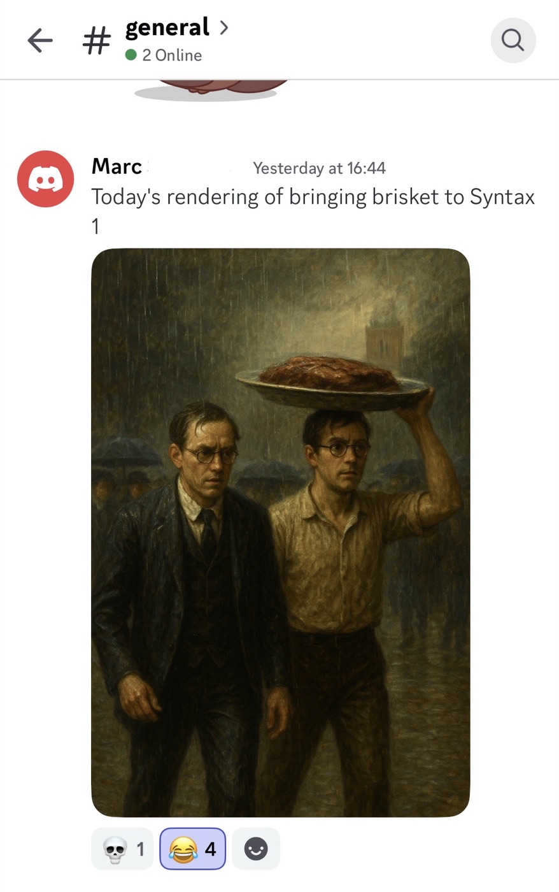
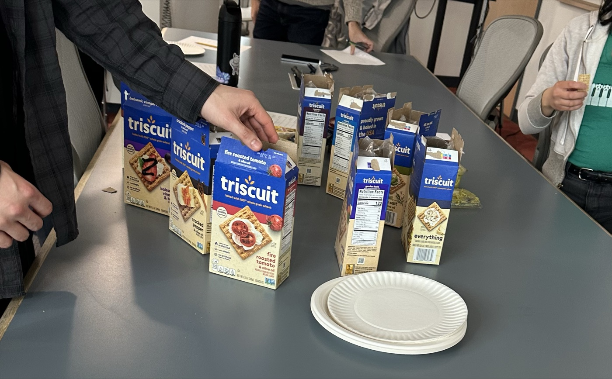
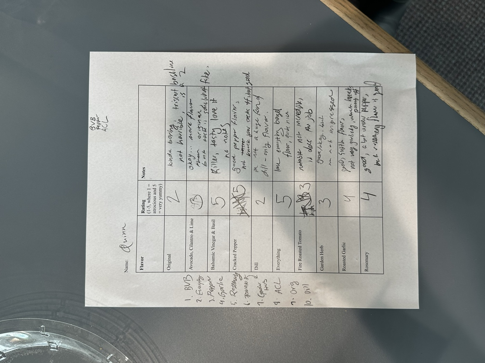
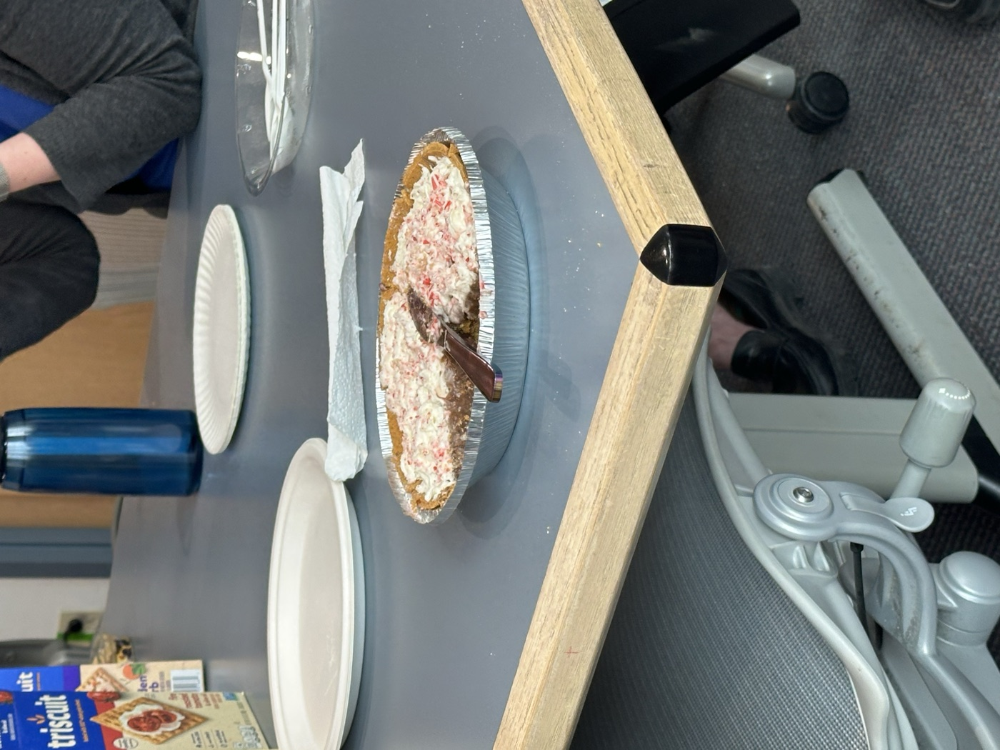
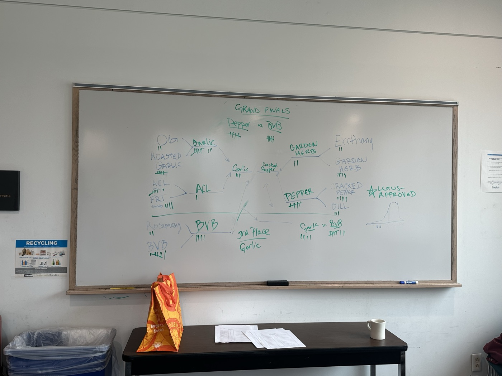

I love college student shenanigans, especially the harmless, absurd kind that makes the rest of the world roll their eyes in fond exasperation. It's the nonsense that emerges when a bunch of young people have total freedom, no money, and the full educational world at their fingertips for the first time in their lives.

I remember seeing this image of people setting up a card game in an elevator when I was maybe twelve years old. My immediate thought was: I need to go to college.

<figure class="fig-small">
  
  <figcaption>“there are guys in my dorm who decided to play cards in the elevator” (<a href="https://www.tumblr.com/haedia/98958712404/thewolfofnibu-stahscre4m-there-are-guys-in" target="_blank" rel="noopener">via Tumblr</a>)</figcaption>
</figure>

In all seriousness, this kind of stuff is ultimately good for society. The role of higher education is not just to teach you about the world (and its laws and history and mystery), but to teach you how to be *in* the world. And cards-in-the-dormitory-elevator is a first-class lesson in agency. The furniture isn't exactly bolted down. If you've got a pack of cards and a few able-bodied people among you, it's only a matter of pressing the elevator call button and a little interior design to make it happen!

It also teaches committing to the bit. That's important too, as acclimation to the yes-and game of everyday sociality. A little faux confidence and a learned resistance to folding under pressure can at least make it look to others like you're not suffering from imposter syndrome. So when the elevator opens up onto another floor, don't break character, don't laugh, don't explain. *They're* being weird if they bring it up — they're interrupting your game, after all.

Graduate school shenanigans are the higher-layer abstraction over the world of university shenanigans. Having already passed through the pressure cooker of the bachelor's degree, graduate students generally welcome the simple pleasures of some harmless nonsense. If anything, their shenanigans can be funnier, more absurd, and speak all the more to the resilience of the human spirit.

<figure class="fig-pair">
  

    
    
  

  <figcaption>Our very first graduate student shenanigan, bringing a tray of BBQ brisket to Syntax I through the pouring rain.</figcaption>
</figure>

Everything in graduate school tries to break you. You're in your mid-20's or 30's and you think you have it all together, then suddenly you are taking introductory courses with teenagers. And the teenagers are *excelling* and you have *no idea* what is going on. So no, we grad students may not have time to orchestrate a whole elaborate scheme (we are busy fighting for our lives in COSI 21A), but we have a few bucks and the means to book a conference room for a couple of hours.

You see, the beauty of the grad school shenanigan is its *organization*. There is an intentional and institutionalized flow of information in the planning, preparation, and execution of the whole operation. There is definitely a listserv. Or possibly a flyer made with Canva.

In the case of my cohort, our elevator-cards moment was the Triscuit Taste Test (TTT), realized entirely by my classmate Claire. The TTT started like this: our classmate Marc is from Canada, where Triscuit crackers are not widely available. He has repeatedly expressed a love for Triscuits and delight at his newfound proximity to them here in the US. One week, there was a killer sale on Triscuits at the local grocery store. Claire noticed this sale and bought one of every flavor, then took to our cohort's Discord to determine a time.

<figure>
  
  <figcaption>The contenders: one box of every flavor.</figcaption>
</figure>

Though "taste test" implies a relaxed event, the TTT was anything but. We were conducting a rigorous, democratic assessment of the many flavors Triscuit has to offer, with the goal of deciding the best one. Claire even made crib sheets for note-taking (the sheets were collected for further statistical evaluation). We kept a tournament bracket chart on the whiteboard to keep up with the top Triscuit throughout the TTT. There were also accoutrements available — though Triscuits were to be evaluated independently, we had an assortment of continental cheeses, spreads, and a chocolate pudding pie for post-eval snacking.

  <figure>
    
    <figcaption>One voter's completed crib sheet.</figcaption>
  </figure>
  <figure>
    
    <figcaption>Liam's famous chocolate pudding pie.</figcaption>
  </figure>

A couple of tight rounds required a tiebreaker, so we recruited help from faculty. Professor Lotus Goldberg decided the Roasted Garlic vs. Avocado Cilantro Lime (ACL) round, and Professor Antonella Di Lillo weighed in on the following Roasted Garlic vs. Balsamic Vinegar and Basil (BVB) round in BVB's favor. Until a late-game voter joined and turned the tide, it was Cracked Black Pepper Triscuit that won the TTT. Our final winner (only revealed the next day) was BVB.

<blockquote class="pullquote">
  
“I spent two hours of my time… just to hear that pepper wins.”

  <cite>— Edith, CLMS ’27</cite>
</blockquote>

<figure>
  
  <figcaption>The completed bracket. Grand finals: Pepper vs. BVB.</figcaption>
</figure>

Though it was a sale on Triscuits that originally started it all, the TTT was never really about the Triscuits. It was the elevator-cards lesson all over again: that there is power in the act of deciding that the world is yours to rearrange. Graduate school can seem to be all about professional or academic success, but in some ways it's really about the people you meet and the memories you make together. Zooming out and making time for shenanigans certainly helps the latter.

I know for certain that I will never forget those few hours in Volen 109 on the snowy Brandeis campus. Thank you to all who were involved, and shame on all who voted against Balsamic Vinegar and Basil.

## Final averages

<table class="ttt-results">
<thead><tr><th>#</th><th>Flavor</th><th>Avg.</th></tr></thead>
<tbody>
<tr class="winner"><td>1</td><td>Balsamic Vinegar &amp; Basil</td><td>4.60</td></tr>
<tr><td>2–3</td><td>Cracked Pepper</td><td>4.00</td></tr>
<tr><td>2–3</td><td>Rosemary</td><td>4.00</td></tr>
<tr><td>4</td><td>Everything</td><td>3.95</td></tr>
<tr><td>5</td><td>Dill</td><td>3.83</td></tr>
<tr><td>6</td><td>Garden Herb</td><td>3.78</td></tr>
<tr><td>7–8</td><td>Fire Roasted Tomato</td><td>3.33</td></tr>
<tr><td>7–8</td><td>Roasted Garlic</td><td>3.33</td></tr>
<tr><td>9</td><td>Avocado, Cilantro &amp; Lime</td><td>3.00</td></tr>
<tr><td>10</td><td>Original</td><td>2.89</td></tr>
</tbody>
</table>
